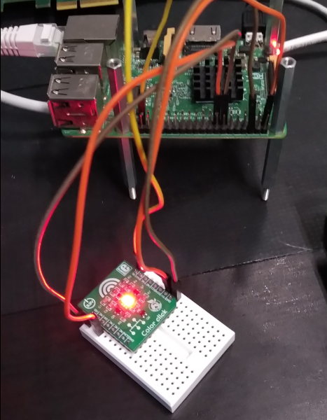

# LED Module with Devicetree Binding (open firmware)

The demo prepares the led driver for external hardware (color click
hat for RPI) using a `struct miscdevice`. This demo only shows the
binding of DT to the kernel module, w/o blinking.  

Shows a mere copy for personal notes of A. Rios LED driver for the 5.4
Kernel (originally), tested on 6.1.  

## ColorClick Hardware: https://www.mikroe.com/color-click

  

Connect the ColorClick device as follows:  
- RPI: GPIO27 -> ColorClick: RD
- RPI: GPIO22 -> ColorClick: GR
- RPI: GPIO26 -> ColorClick: BL
- RPI: GND 39 -> ColorClick: GND
- RPI: 3V3 01 -> ColorClick: 5V

#### Notes on `container_of()`

```
    container_of(ptr, type, member)
```

* ptr – the pointer to an instance
* type – the type of the container struct
* member – the name of the member within the struct

The `container_of` macro then returns the address of the member for the specified instance.  
[further details on IOMUX on NPX's iMX7D p125ff -> references]  


# Build

## Devicetree
The devicetree fragment should be (also) compatible to the `bcm2710-rpi-3-b.dts` for e.g. rpi 3b.  

## Module
Compile cross having ``crossbuild-essentials-arm64`` installed. `ARCH`, and `CROSS_COMPILE` are set, then execute  
```
$ cd ./module
$ make
```
Copy the *.ko and *.dtbo over to the target. Move the *.dtbo to `/boot/overlay/` and register it in `/boot/config.txt`  

```
...
[all]
dtoverlay = <name of the .dtbo file>
```

## Userspace
Easiest is to copy the folder `userspace`  to the target  
```
rpi$ cd ./userspace
rpi$ make
```

# Usage

  

On the target perform the following to verify the functionality  
```
pi@raspberrypi:~$ sudo insmod chardev.ko

pi@raspberrypi:~$ sudo find /sys -name "*lothar*"
    /sys/bus/platform/drivers/lotharskeys
    /sys/module/chardev/drivers/platform:lotharskeys

pi@ctrl001:/tmp $ sudo mknod /dev/mydev c 202 0

pi@ctrl001:/tmp $ sudo ./ioctl_test.elf

pi@raspberrypi:~$ sudo rmmod chardev
```
FIXME: no blinking device, are the node numbers correct? shall ioctl app be used at all?   
The module could be load, the devicetree binding would match.  

## Verified
* Verified against a RPI3 w/ aarch64

## References
* Linux Driver Development for Embedded Procesesors, A. L. Rios, 2018, p. 161
