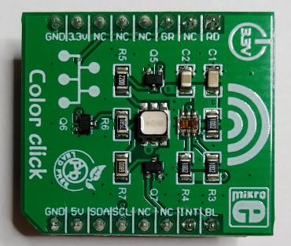
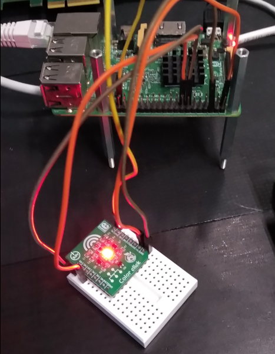

# LED Module with Devicetree Binding (open firmware)

  

The demo prepares the led driver for external hardware (color click
hat for RPI) using a `struct miscdevice`. This demo only shows the
binding of DT to the kernel module, w/o blinking.  

Shows a mere copy for personal notes of A. Rios LED driver for the 5.4
Kernel (originally), tested on 6.1.  

## ColorClick Hardware: https://www.mikroe.com/color-click

Connect the ColorClick device as follows:  
- RPI: GPIO27 -> ColorClick: RD
- RPI: GPIO22 -> ColorClick: GR
- RPI: GPIO26 -> ColorClick: BL
- RPI: GND 39 -> ColorClick: GND
- RPI: 3V3 01 -> ColorClick: 5V

#### Notes on `container_of()`

```
    container_of(ptr, type, member)
```

* ptr – the pointer to an instance
* type – the type of the container struct
* member – the name of the member within the struct

The `container_of` macro then returns the address of the member for the specified instance.  
[further details on IOMUX on NPX's iMX7D p125ff -> references]  


# Build

## Module

For cross-compilation install `crossbuild-essentials-arm64`,
set at least `ARCH`, and `CROSS_COMPILE`. Build the rpi kernel
according to the rpi documentation.  
```
$ cat ~/workspace/source-me.sh
    export CROSS_COMPILE=aarch64-linux-gnu-
    export ARCH=arm64
    export KERNEL=kernel8
    export KDEFCONFIG_NAME=bcm2711_defconfig
    export KERNELDIR=/usr/src/linux
```

Build the module  
```
$ make
```
Copy the module to the target device  

The DT overlay fragment is built with the module. Copy the DT overlay
fragment to the target device, to `/boot/overlays`. Register the DT
overlay fragment in `/boot/configs.txt`.  

```
    ...
    [all]
    dtoverlay = <name of the .dtbo file>
    ...
```
Then reboot. Verify that phandles of the fragment are searcheable in the DT.  
```
# dtc -I fs -O dts /sys/firmware/devicetree/base | less
```

# Usage

  

On the target perform the following to verify the functionality  
```
pi@raspberrypi:~$ sudo insmod chardev.ko

pi@raspberrypi:~$ sudo find /sys -name "*lothar*"
    /sys/bus/platform/drivers/lotharskeys
    /sys/module/chardev/drivers/platform:lotharskeys

pi@raspberrypi:~$ sudo rmmod chardev
```
The module could be load, the devicetree binding would match.  

## References
* Linux Driver Development for Embedded Procesesors, A. L. Rios, 2018, p. 161
