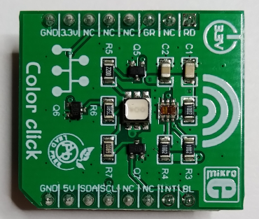

# LED Module with Devicetree Binding (LED class)

  

Now instead of the miscdevice, uses the self implemented "led class
device". The driver now shows a blinking device.  

## ColorClick Hardware: https://www.mikroe.com/color-click

Connect the ColorClick device as follows:  
- RPI: GPIO27 -> ColorClick: RD
- RPI: GPIO22 -> ColorClick: GR
- RPI: GPIO26 -> ColorClick: BL
- RPI: GND 39 -> ColorClick: GND
- RPI: 3V3 01 -> ColorClick: 5V

## The LED class driver demo of A. Rios (see references)

The LED class will simplify the development of drivers that control
LEDs. A "class" is both the implementation of a set of devices and the
set of devices themselves.  

The LED class supports the blinking, flashing and brightness control
features of physical LEDs. This class requires an underlying device to
be available (`/sys/class/leds/<device>/`). This underlying device mus
be able to turn the LED on or off, may be able to set the brightness
and might even provide timer functionality to autonomously blink the
LED with a given period and duty cycle.  

Note, the LED class introduces the optional concept of LED trigger. A
trigger is a kernel based source of LED events. The timer trigger is
an example that will periodically change the LED brightness between
LED_OFF and the current brightness setting. The "on" and "off" time
can be specified via `/sys/class/leds/<device>/delay_{on,off}` sysfs
entry in miliseconds.  

Note for the probe:  
* The `platform_get_resource()` function gets the I/O registers
  resource described by the DT reg property.
* The `dev_ioremap()` function maps the area of register addresses to
  kernel virtual addresses.
* The `for_each_child_of_node()` function walks for each sub-node of
  the main node, allocating a private structure for each one by using
  the `devm_kzalloc()` function, then initializes the `led_classdev`
  field of each private structure.
* The `devm_led_classdev_register()` function registers each LED class
  device to the LED subsystem.

Note, ledclass_dev is provided by the kernel.  

[further details on IOMUX on NPX's iMX7D p125ff -> references]

# Build

## Module
For cross-compilation install `crossbuild-essentials-arm64`,
set at least `ARCH`, and `CROSS_COMPILE`. Build the rpi kernel
according to the rpi documentation.  
```
$ cat ~/workspace/source-me.sh
    export CROSS_COMPILE=aarch64-linux-gnu-
    export ARCH=arm64
    export KERNEL=kernel8
    export KDEFCONFIG_NAME=bcm2711_defconfig
    export KERNELDIR=/usr/src/linux
```

Build the module  
```
$ make
```
Copy the module to the target device  

The DT overlay fragment is built with the module. Copy the DT overlay
fragment to the target device, to `/boot/overlays`. Register the DT
overlay fragment in `/boot/configs.txt`.  

```
    ...
    [all]
    dtoverlay = <name of the .dtbo file>
    ...
```
Then reboot. Verify that phandles of the fragment are searcheable in the DT.  
```
# dtc -I fs -O dts /sys/firmware/devicetree/base | less
```

# Usage
On the target perform the following to verify the functionality  
```
pi@ctrl001:/tmp $ sudo insmod ./leddriver.ko

pi@ctrl001:/tmp $ sudo rmmod leddriver

pi@ctrl001:/tmp $ dmesg | tail
    [   32.537000] RGBclassleds 3f200000.ledclassRGB: ledclass_probe() started
    [   32.537015] RGBclassleds 3f200000.ledclassRGB: res->start = 0x3f200000
    [   32.537028] RGBclassleds 3f200000.ledclassRGB: res->end = 0x3f2000b3
    [   32.537061] RGBclassleds 3f200000.ledclassRGB: there are 3 nodes
    [   32.537407] RGBclassleds 3f200000.ledclassRGB: ledclass_probe() done
    [   32.537686] led_init() done
    [  354.392738] led_exit() started
    [  354.392807] RGBclassleds 3f200000.ledclassRGB: ledclass_remove() started
    [  354.392821] RGBclassleds 3f200000.ledclassRGB: ledclass_remove() done
    [  354.411571] led_exit() done
```
The module could be load, the devicetree binding would match.  

## Verified
* Verified against a RPI3 w/ aarch64

## References
* Linux Driver Development for Embedded Procesesors, A. L. Rios, 2018, p. 176
