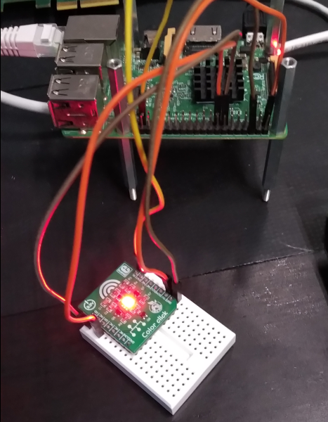

# LED Module with Devicetree Binding (UIO demo)

  

Userspace driver advantages:  
 - Easy to debug
 - Floating point is avaiable
 - Efficient device accesss w/o required systemcall
 - Stable application API on Linux
 - Different languages than C are possible

Userspace driver disadvantages:  
 - No access to the kernel framework and services
 - Interrupt handling cannot be done from userspace
 - No predefined API to allow applications to access device drivers

Kernelspace driver advantages:  
 - Highest privilege mode to allow access to interrupts and hardware resources
 - Many kernel services such that kernelspace drivers can be designed for complex devices
 - Simultaneous access by multiple applications to the same kernel driver

Kernelspace driver disadvantages:  
 - Systemcall overhead to access drivers
 - Challenging debug
 - Frequent kernel API changes in the kernel

## User Defined I/O - UIO

There are distinct types of UIO device drivers.  

#### UIO driver: `drivers/uio.c`

Make sure /lib/modules are copied and the kernel name (`uname`) is at least there as symlink.  

- The UIO driver creates file attributes in the sysfs describing the
  UIO device. It also maps the device memory into the process address
  space using its mmap() function.

- A minimal kernelspace driver `uio_pdrv_genirq` (i.e. **UIO platform
  driver with generic interrupts**), or **user provided kernel
  driver** is required to set up the UIO framework.

#### UIO platform driver: `drivers/uio_pdev_genirq.c`
- Provides the required kernelspace driver for UIO

- It works with the DT. The DT node needs to use `generic-uio` in its
  `compatible` property.

- The UIO platform device driver is configured from the DT and
  registers an UIO device.

[further details on IOMUX on NPX's iMX7D p125ff -> references]

## UIO Workflow

1. UIO device: `/sys/class/uio/uio0`

2. The `/sys/class/uio/uio0/<name>/` directory contains the name of
   the device which correlates to the name in the `struct uio_info`
   structure

3. The `/sys/class/uio/uio0/maps/` directory has all the memory ranges
   for the device.

4. Each UIO device can make one or more memory regions available for memory mapping. Each mapping has its own directory in sysfs, the first mapping appears as `/sys/class/uio/uioX/maps/map0/`. Subsequent mappings create directories `map1/`, `map2/` and so on. These directories will only appear if the size of the mapping is not 0. Each `mapX/` directory contains four read-only files that show attributes of the memory:  

 - name: string identifier for the mapping
 - addr: address of memory that can be mapped
 - size: size in bytes of the memory pointed to
 - offset: offset in bytes that has to be added to the pointer
   returned by mmap() to get the actual device memory


The `offset` is important if the device's memory is not page aligned. Remember that **pointers returned by mmap() are always pagealigned**, so it is a good practice to always add this offset!!!  

NB: **Interrupts** are handled by reading from `/dev/uioX`. A blocking `read()` from `/dev/uioX` will return as soon as an interrupt occurs. You can also use `select()` on `/dev/uioX` to wait for an interrupt. The integer value read from `/dev/uioX` represents the total interrupt count. You can use this number to figure out if you missed some interrupts. Compare the interrupt counts also to `/proc/interrupts`  

## Some notes on Kernel UIO API (v5.4)

- `long irq`: required. If your hardware generates an interrupt, it's
  your modules' task to determine the irq number during
  initialization. If you don't have a hardware generated interrupt but
  want to trigger the interrupt handler in some other way, set irq to
  `UIO_IRQ_CUSTOM`. If you had no interrupt at all, you could set irq
  to `UIO_IRQ_NONE`, though this rarely makes sense.
- `int memtype`: Required if mapping is used. Set this to
  `UIO_MEM_PHYS` if you have physical memory to be mapped. Use
  `UIO_MEM_LOGICAL` for logical memory (for example, allocated with
  `kmalloc()`). There's also `UIO_MEM_VIRTUAL` for virtual memory.

## Devicetree

```
    / {
        model = "...
        compatible = "...
        ...
        expgpio: expgpio {
            compatible = "brcm,bcm2835-expgpio";
            gpio-controller;
            #gpio-cells = <2>;
            firmware = <&fimrware>;
            status = "okay";
        };
        ...
        UIO {
            comatible = "lothars,uio";
            reg = <0x7e200000 0x1000>;
            pinctrl-names = "default";
            pinctrl-0 = <&led_pins>;
        };
        ...
```

## ColorClick Hardware: https://www.mikroe.com/color-click

Connect the ColorClick device as follows:  
- RPI: GPIO27 -> ColorClick: RD
- RPI: GPIO22 -> ColorClick: GR
- RPI: GPIO26 -> ColorClick: BL
- RPI: GND 39 -> ColorClick: GND
- RPI: 3V3 01 -> ColorClick: 5V

  

# Build

## Devicetree
The devicetree fragment should be (also) compatible to the `bcm2710-rpi-3-b.dts` for e.g. rpi 3b.  

## Module
Compile cross having ``crossbuild-essentials-arm64`` installed. `ARCH`, and `CROSS_COMPILE` are set, then execute  
```
$ cd ./module
$ make
```
Copy the *.ko and *.dtbo over to the target. Move the *.dtbo to `/boot/overlay/` and register it in `/boot/config.txt`  

```
...
[all]
dtoverlay = <name of the .dtbo file>
...
```

## Module
For cross-compilation install `crossbuild-essentials-arm64`,
set at least `ARCH`, and `CROSS_COMPILE`. Build the rpi kernel
according to the rpi documentation.  
```
$ cat ~/workspace/source-me.sh
    export CROSS_COMPILE=aarch64-linux-gnu-
    export ARCH=arm64
    export KERNEL=kernel8
    export KDEFCONFIG_NAME=bcm2711_defconfig
    export KERNELDIR=/usr/src/linux
```

Build the module  
```
$ cd ./module
$ make
```
Copy the module to the target device  

The DT overlay fragment is built with the module. Copy the DT overlay
fragment to the target device, to `/boot/overlays`. Register the DT
overlay fragment in `/boot/configs.txt`.  

```
    ...
    [all]
    dtoverlay = <name of the .dtbo file>
    ...
```
Then reboot. Verify that phandles of the fragment are searcheable in the DT.  
```
# dtc -I fs -O dts /sys/firmware/devicetree/base | less
```

## Userspace
Easiest is to copy the folder `userspace`  to the target  
```
rpi$ cd ./userspace
rpi$ make
```

# Usage
```
# insmod ./leddriver.ko

# lsmod | grep leddriver
    leddriver              16384  0
    uio                    24576  2 uio_pdrv_genirq,leddriver

# ls /sys/class/uio/uio0/
    dev  device  event  maps  name  power  subsystem  uevent  version

# cat /sys/class/uio/uio0/name
    lothars_device

# cat /sys/class/uio/uio0/maps/map0/size
    0x0000000000001000

# ./userland.elf
    main(): started
    main(): /dev/mem opened
    main(): /dev/uio0 opened
    main(): the size read from '/sys/class/uio/uio0/maps/map0/size' is 0x4096
    main(): memory mapped to 'demo_driver_map'
    main(): enter a led value [on|off|exit]

    on
    readstring(): input was 'on'
    main(): enter a led value [on|off|exit]

    off
    readstring(): input was 'off'
    main(): enter a led value [on|off|exit]

    exit
    readstring(): input was 'exit'
    main(): exit - terminating
    main(): closing down
    main(): done
```

## References
* Linux Driver Development for Embedded Procesesors, A. L. Rios, 2018, p. 197  
