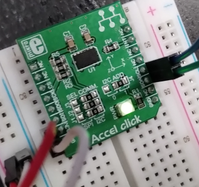
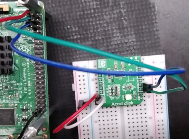

# ADXL345 Accel polling driver based on the input system

  

Use the ADXL345 Accel click mikroBUS accessory board connected to the
I2C bus of the processor to verify the driver. The driver will scan
periodially the value of one of the accelerometer axes, and depending
on the tilt of the board, it will generate an event that is exposed to
the application `evtest`. The accelerometer kernel module will use the
polled input subclass. A polled input device provides a skeleton for
supporting simple input devices that do not raise interrupts, but have
to be periodically scanned or polled to detect changes in their state.  

The book example is based on the old input api. Nowadays the driver
would look differently. This is an implementation with current kernel
API of the given exercise theme.  

## Hardware

- ADXL345 Accel click mikroBUS: https://www.mikroe.com/accel-spi-board

#### Connection:
- GPIO02 -> SDA
- GPIO03 -> SCL
- 3v3 -> 3v3
- GND -> GND

  

# Build

## Devicetree

## Module

Having crossbuild-essentials-arm64 installed, ARCH, and CROSS_COMPILE set, execute  
```
$ cd ./module
$ make
```
Copy the module over to the target. Copy the `.dtbo` file to `/boot/overlays` and register the DT overlay in `/boot/config.txt` as `dtoverlay`.  

## Usage

See the connected Accel Click appears on `1d` (i2c).  
```
$ sudo su
# modprobe i2c-dev

# i2cdetect -l
    i2c-10	i2c       	i2c-11-mux (chan_id 1)          	I2C adapter
    i2c-1	i2c       	bcm2835 (i2c@7e804000)          	I2C adapter
    i2c-11	i2c       	bcm2835 (i2c@7e205000)          	I2C adapter
    i2c-0	i2c       	i2c-11-mux (chan_id 0)          	I2C adapter

# i2cdetect -y 1
         0  1  2  3  4  5  6  7  8  9  a  b  c  d  e  f
    00:                         -- -- -- -- -- -- -- --
    10: -- -- -- -- -- -- -- -- -- -- -- -- -- 1d -- --
    20: -- -- -- -- -- -- -- -- -- -- -- -- -- -- -- --
    30: -- -- -- -- -- -- -- -- -- -- -- -- -- -- -- --
    40: -- -- -- -- -- -- -- -- -- -- -- -- -- -- -- --
    50: -- -- -- -- -- -- -- -- -- -- -- -- -- -- -- --
    60: -- -- -- -- -- -- -- -- -- -- -- -- -- -- -- --
    70: -- -- -- -- -- -- -- --
```

Check functionality of the accelerometer.  
```
# i2cset -y 1 0x1d 0x2d 0x08
# while true; do i2cget -y 1 0x1d 0x33; sleep 1; done
    0xff
    0xff
    0xff
    0xff
    0xff
    0x00 <--- move the module around, to generate input data
    0x01
    0x01
    0xfe
    0xff
    0xff
    0xff
    0xff
    0xff
    ^C
```

Load the module and observe incoming data on i2c with the tool evtest.  
```
# insmod input_demo.ko

# evtest /dev/input/event0
    Input driver version is 1.0.1
    Input device ID: bus 0x18 vendor 0x0 product 0x0 version 0x0
    Input device name: "IOACCEL keyboard"
    Supported events:
      Event type 0 (EV_SYN)
      Event type 1 (EV_KEY)
        Event code 2 (KEY_1)
    Properties:
    Testing ... (interrupt to exit)

--- move the board, to generate input data with the accelerometer ---

    Event: time 1703185720.684805, type 1 (EV_KEY), code 2 (KEY_1), value 1
    Event: time 1703185720.684805, -------------- SYN_REPORT ------------
    Event: time 1703185720.740839, type 1 (EV_KEY), code 2 (KEY_1), value 0
    Event: time 1703185720.740839, -------------- SYN_REPORT ------------
    Event: time 1703185720.852791, type 1 (EV_KEY), code 2 (KEY_1), value 1
    Event: time 1703185720.852791, -------------- SYN_REPORT ------------
    Event: time 1703185720.908827, type 1 (EV_KEY), code 2 (KEY_1), value 0
    Event: time 1703185720.908827, -------------- SYN_REPORT ------------
    Event: time 1703185721.692780, type 1 (EV_KEY), code 2 (KEY_1), value 1
    Event: time 1703185721.692780, -------------- SYN_REPORT ------------
    Event: time 1703185721.748833, type 1 (EV_KEY), code 2 (KEY_1), value 0
    Event: time 1703185721.748833, -------------- SYN_REPORT ------------
    Event: time 1703185721.916789, type 1 (EV_KEY), code 2 (KEY_1), value 1
    Event: time 1703185721.916789, -------------- SYN_REPORT ------------
    Event: time 1703185721.972838, type 1 (EV_KEY), code 2 (KEY_1), value 0
    Event: time 1703185721.972838, -------------- SYN_REPORT ------------
    ^C

# rmmod input_demo
```

Follow the logs   
```
Dec 21 19:01:13 ctrl001 kernel: [  722.135841] i2c_dev: i2c /dev entries driver

Dec 21 19:08:06 ctrl001 kernel: [ 1135.192614] input_demo: loading out-of-tree module taints kernel.
Dec 21 19:08:06 ctrl001 kernel: [ 1135.194003] adxl345 1-001d: ioaccel_probe() - called
Dec 21 19:08:06 ctrl001 kernel: [ 1135.195141] input: IOACCEL keyboard as /devices/platform/soc/3f804000.i2c/i2c-1/1-001d/input/input0
```

## References
* Linux Driver Development for Embedded Procesesors, A. L. Rios, 2018, p. 423  
