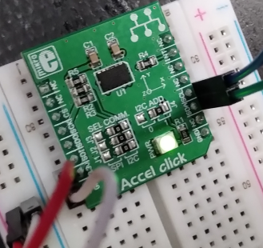

# DMA from user space

Use the ADXL345 Accel click mikroBUS accessory board connected to the
I2C bus of the processor to verify the driver. The driver will scan
periodially the value of one of the accelerometer axes, and depending
on the tilt of the board, it will generate an event that is exposed to
the application `evtest`. The accelerometer kernel module will use the
polled input subclass. A polled input device provides a skeleton for
supporting simple input devices that do not raise interrupts, but have
to be periodically scanned or polled to detect changes in their state.  

This is the SPI version of the demo.  

## Hardware

IMPORTANT: check which communication channel is soldered on the clickboard.
There need to be set three 0 Ohm resistors to either SPI or I2C on J1, J2,
J3. Make sure to have SPI soldered for this setup.

- ADXL345 Accel click mikroBUS: https://www.mikroe.com/accel-spi-board

  

Connection (RPI3b to ADXL345):  
- SPI_CE0_N, GPIO08 / pin 24 -> CS
- SPI_SCLK, GPIO11 / pin 23 -> SCK
- SPI_MISO, GPIO09 / pin 21 -> SDO
- SPI_MOSI, GPIO10 / pin 19 -> SDI
- GPIO23 / pin 16 -> INT
- 3v3 -> 3v3
- GND -> GND

# Build

## Module

Having crossbuild-essentials-arm64 installed, ARCH, and CROSS_COMPILE set, execute  
```
$ cd ./module
$ make
```
Copy the module over to the target. Copy the `.dtbo` file to `/boot/overlays` and register the DT overlay in `/boot/config.txt` as `dtoverlay`.  

## Usage

```
$ sudo su
# modprobe input_demo.ko

# ll /sys/class/input/input0/device
    lrwxrwxrwx 1 root root 0 Feb 25 17:27 /sys/class/input/input0/device -> ../../../spi0.0

# ll /sys/class/input/input0/device/
    total 0
    lrwxrwxrwx 1 root root    0 Feb 25 17:25 driver -> ../../../../../../../bus/spi/drivers/adxl345
    -rw-r--r-- 1 root root 4096 Feb 25 17:34 driver_override
    drwxr-xr-x 3 root root    0 Feb 25 17:25 input
    -r--r--r-- 1 root root 4096 Feb 25 17:34 modalias
    lrwxrwxrwx 1 root root    0 Feb 25 17:34 of_node -> ../../../../../../../firmware/devicetree/base/soc/spi@7e204000/adxl345@0
    -r--r--r-- 1 root root 4096 Feb 25 17:34 position
    drwxr-xr-x 2 root root    0 Feb 25 17:34 power
    -rw-rw-r-- 1 root root 4096 Feb 25 17:34 rate
    -r--r--r-- 1 root root 4096 Feb 25 17:34 read
    drwxr-xr-x 2 root root    0 Feb 25 17:34 statistics
    lrwxrwxrwx 1 root root    0 Feb 25 17:25 subsystem -> ../../../../../../../bus/spi
    lrwxrwxrwx 1 root root    0 Feb 25 17:34 supplier:platform:3f200000.gpio -> ../../../../../../virtual/devlink/platform:3f200000.gpio--spi:spi0.0
    -rw-r--r-- 1 root root 4096 Feb 24 20:45 uevent
```

read the three axes values, move the accel board and read again  
```
# cat /sys/class/input/input0/device/read
    (-20, -20, 244)
# cat /sys/class/input/input0/device/read
    (-20, -21, 245)
# cat /sys/class/input/input0/device/read
    (-19, -21, 245)
# cat /sys/class/input/input0/device/read
    (-21, -20, 243)
    ...
```

read the data rate, and change the data rate  
```
i# cat /sys/class/input/input0/device/rate 
    8
# echo 10 > /sys/class/input/input0/device/rate 
# cat /sys/class/input/input0/device/rate 
    10
```

run `evtest` and move the board to generate accelerometer data  
```
# evtest /dev/input/event0
    Input driver version is 1.0.1
    Input device ID: bus 0x1c vendor 0x0 product 0x0 version 0x0
    Input device name: "ADXL345 accelerometer"
    Supported events:
      Event type 0 (EV_SYN)
      Event type 1 (EV_KEY)
        Event code 330 (BTN_TOUCH)
    Properties:
    Testing ... (interrupt to exit)
    Event: time 1708882271.150456, type 1 (EV_KEY), code 330 (BTN_TOUCH), value 1
    Event: time 1708882271.150456, -------------- SYN_REPORT ------------
    Event: time 1708882271.150552, type 1 (EV_KEY), code 330 (BTN_TOUCH), value 0
    Event: time 1708882271.150552, -------------- SYN_REPORT ------------
    Event: time 1708882271.187666, type 1 (EV_KEY), code 330 (BTN_TOUCH), value 1
    Event: time 1708882271.187666, -------------- SYN_REPORT ------------
    Event: time 1708882271.187772, type 1 (EV_KEY), code 330 (BTN_TOUCH), value 0
    Event: time 1708882271.187772, -------------- SYN_REPORT ------------
    Event: time 1708882272.041925, type 1 (EV_KEY), code 330 (BTN_TOUCH), value 1
    Event: time 1708882272.041925, -------------- SYN_REPORT ------------
    Event: time 1708882272.042010, type 1 (EV_KEY), code 330 (BTN_TOUCH), value 0
    Event: time 1708882272.042010, -------------- SYN_REPORT ------------
    Event: time 1708882272.484454, type 1 (EV_KEY), code 330 (BTN_TOUCH), value 1
    Event: time 1708882272.484454, -------------- SYN_REPORT ------------
    Event: time 1708882272.484550, type 1 (EV_KEY), code 330 (BTN_TOUCH), value 0
    Event: time 1708882272.484550, -------------- SYN_REPORT ------------
    Event: time 1708882273.034771, type 1 (EV_KEY), code 330 (BTN_TOUCH), value 1
    Event: time 1708882273.034771, -------------- SYN_REPORT ------------
    Event: time 1708882273.034856, type 1 (EV_KEY), code 330 (BTN_TOUCH), value 0
    Event: time 1708882273.034856, -------------- SYN_REPORT ------------
^C

# rmmod input_demo.ko
```

Logs   
```
# tail -f /var/log/messages
    Feb 25 17:25:42 ctrl001 kernel: [   70.118706] input_demo: loading out-of-tree module taints kernel.
    Feb 25 17:25:42 ctrl001 kernel: [   70.121381] adxl345 spi0.0: adxl345_spi_probe() - called
    Feb 25 17:25:42 ctrl001 kernel: [   70.121425] adxl345 spi0.0: adxl345_probe() - called
    Feb 25 17:25:42 ctrl001 kernel: [   70.121481] adxl345 spi0.0: adxl345_spi_read() - called
    Feb 25 17:25:42 ctrl001 kernel: [   70.121545] adxl345 spi0.0: adxl345_probe() - DEVID: 0xE5
    Feb 25 17:25:42 ctrl001 kernel: [   70.121572] adxl345 spi0.0: adxl345_probe() - dev_name(dev) 'spi0.0'
    Feb 25 17:25:42 ctrl001 kernel: [   70.121595] adxl345 spi0.0: adxl345_probe() - ADXL345 is found
    Feb 25 17:25:42 ctrl001 kernel: [   70.121619] adxl345 spi0.0: adxl345_probe() - ac->phys 'spi0.0/input0'
    Feb 25 17:25:42 ctrl001 kernel: [   70.121787] adxl345 spi0.0: adxl345_probe() - the IRQ number is: 185
    Feb 25 17:25:42 ctrl001 kernel: [   70.122803] input: ADXL345 accelerometer as /devices/platform/soc/3f204000.spi/spi_master/spi0/spi0.0/input/input0
    Feb 25 17:25:42 ctrl001 kernel: [   70.124292] adxl345 spi0.0: adxl345_spi_write() - called
    Feb 25 17:25:42 ctrl001 kernel: [   70.124364] adxl345 spi0.0: adxl345_spi_write() - called
    Feb 25 17:25:42 ctrl001 kernel: [   70.124403] adxl345 spi0.0: adxl345_spi_write() - called
    Feb 25 17:25:42 ctrl001 kernel: [   70.124440] adxl345 spi0.0: adxl345_spi_write() - called
    Feb 25 17:25:42 ctrl001 kernel: [   70.124485] adxl345 spi0.0: adxl345_spi_write() - called
    Feb 25 17:25:42 ctrl001 kernel: [   70.124523] adxl345 spi0.0: adxl345_spi_write() - called
    Feb 25 17:25:42 ctrl001 kernel: [   70.124561] adxl345 spi0.0: adxl345_spi_write() - called
    Feb 25 17:25:42 ctrl001 kernel: [   70.124597] adxl345 spi0.0: adxl345_spi_write() - called
    Feb 25 17:25:42 ctrl001 kernel: [   70.124635] adxl345 spi0.0: adxl345_spi_write() - called
    Feb 25 17:28:12 ctrl001 kernel: [  220.657963] adxl345 spi0.0: adxl345_irq() - called
    Feb 25 17:28:12 ctrl001 kernel: [  220.658002] adxl345 spi0.0: adxl345_spi_read() - called
    Feb 25 17:28:12 ctrl001 kernel: [  220.658067] adxl345 spi0.0: adxl345_spi_read() - called
    Feb 25 17:28:12 ctrl001 kernel: [  220.658109] adxl345 spi0.0: adxl345_irq() - single tap interrupt has occurred
    Feb 25 17:28:12 ctrl001 kernel: [  220.658134] adxl345 spi0.0: adxl345_do_tap() - called
    Feb 25 17:28:12 ctrl001 kernel: [  220.658157] adxl345 spi0.0: adxl345_send_key_events() - called
    Feb 25 17:28:12 ctrl001 kernel: [  220.658246] adxl345 spi0.0: adxl345_send_key_events() - called
    Feb 25 17:28:27 ctrl001 kernel: [  235.376346] adxl345 spi0.0: adxl345_irq() - called
    Feb 25 17:28:27 ctrl001 kernel: [  235.376385] adxl345 spi0.0: adxl345_spi_read() - called
    Feb 25 17:28:27 ctrl001 kernel: [  235.376449] adxl345 spi0.0: adxl345_spi_read() - called
    ...
```

## References
* Linux Driver Development for Embedded Procesesors, A. L. Rios, 2018, p. 446  
