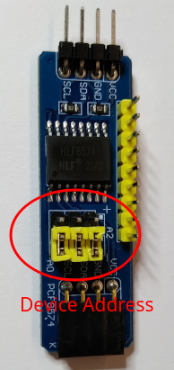
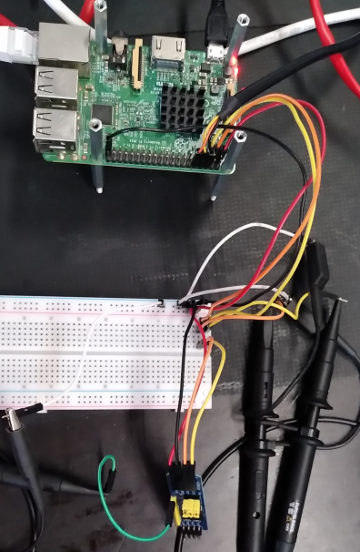
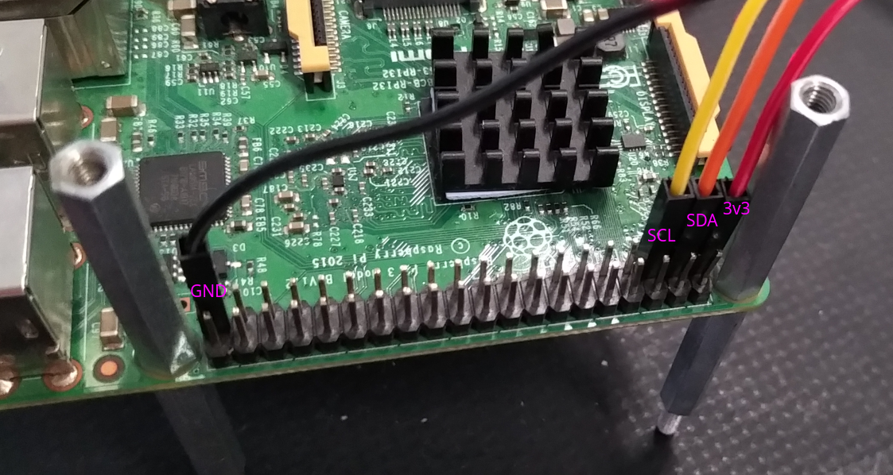
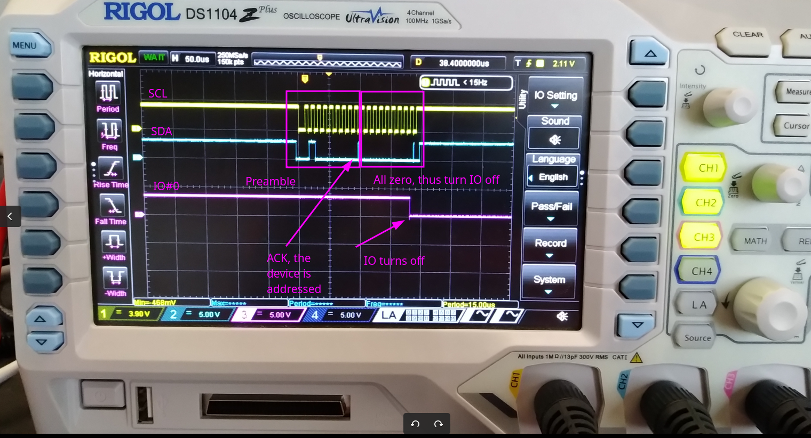

# I2C Client: IO Expander Demo

When writing a driver for an I2C device, try to use the SMBus commands
if at all possible (if the device uses only that subset of the I2C
protocol). This makes it possible to use the device driver on both
SMBus adapters and I2C adapters (the SMBus command set is
automatically translated to I2C on I2C adapters, but plain I2C
commands cannot be handled at all on most pure SMBus adapters.  

## Hardware: PCF8574 I/O Expander Device

PCF8574 I2C Portexpander I/O Erweiterung 8 Pin  
https://www.mikrocontroller.net/articles/Port-Expander_PCF8574

Shop:  
https://www.waveshare.com/pcf8574-io-expansion-board.htm

...and codes:  
https://www.waveshare.com/wiki/PCF8574_IO_Expansion_Board

  


Connect:  

- GPIO2   -> SDA
- GPIO3   -> SCL
- VCC3.3V -> 3.3V
- GND     -> GND

Piggy-back up to 8 pcf8574 devices, adjust the address of each of them by
setting the jumper bars `A0`, `A1` and `A2`. Set them either to `low` (-) or
to `high` (+)  


The I2C slave addressy byte then looks as follows:  
 |--|--|--|--|--|------|------|------|---|  
 |0 |0 |1 |0 |0 |**A2**|**A1**|**A0**|R/W|  
 |--|--|--|--|--|------|------|------|---|  

Where `A0`, `A1` and `A2` are configurable by the jumpers.  
`R/W`: high means a _read_ was selected, low meands a _write_ was selected.  
Measure the outputs on the `P0` through `P7` pins.  

  

  


## The Linux I2C Subsystem

1. The I2C bus core: The core of the I2C subsystem is located in the i2c-core.c file under the `drivers/i2c/` directory. It is a collection of code that provides interface support between an individual client driver and some I2C bus masters such as the iMX7D I2C controllers. It manages bus arbitration, retry handling and various otehr protocol details. It is registered with the `bus_register()` function and declares the I2C `bus_type` structure. The I2C core API is then a set of functions used for an I2C client device driver to send and receive.  

2. The I2C controller drivers: Find the I2C controller drivers under `drivers/i2c/busses/`. The I2C controller is a platform device that must be registered as a device to the platform bus. The I2C controller driver is a set of custom functions that issues read/writes to the I2C controller hardware I/O addresses of the SoC. There is a specific code for each I2C controller on the processor. These specific functions are called by the I2C core API when this invokes the `adap_algo_master_xfer()` after an I2C client driver has initiated an `i2c_transfer()`. In an I2C controller driver for example, you have to declare a private structure that includes an `i2c_adapter` structure.  

# Build

## Devicetree

The demo uses the GPIO expansion connector, GPIO2 and GPIO3 pins to the corresponding pads.  

NB: The GPIO2 and GPIO3 pins are set to the ALT0 function.  
``` ...  &i2c1 { pinctrl-names = "default"; pinctrl-0 = <&i2c1_pins>;
    clock-frequency = <100000>; status = "okay"; ...  ioexp#38 {
    compatible = "lothars,ioexp"; reg = <&0x38>; };

        ioexp@39 {
            compatible = "lothars,ioexp";
            reg = <0x39>;
        };
        ...
    };
    ...
```

A copy of the modified DTS is provided, copy it to the specified location in the linux sources (6.3), then build it.  

```
$ cd linux
$ cp -arf ~/workspace/lothars-modules/030__platform/devicetree_binding_uio_led/devicetree/arch ./

$ make dtbs
  DTC     arch/arm64/boot/dts/broadcom/bcm2710-rpi-3-b.dtb
```
Copy the file `bcm2710-rpi-3-b.dtb` to the target overwriting the `/boot/bcm2710-rpi-3-b.dtb`. In case make a safety backup first.  

## Module
Should crosscompile - having crossbuild-essentials-arm64 installed, ARCH, and CROSS_COMPILE set, execute  
```
$ cd ./module
$ make
```
Copy the module over to the target  

## Usage

Load the module, `probe()` is called, the devices `ioexp00` and `ioexp01` are created, in case provide address of the pcf8574 as `pcf8574_addr=0x20` as module param. In case of setting the A0 jumper to `+`, load the module e.g. as follows: `$ sudo insmod i2c_pcf8574.ko pcf8574_addr=0x21`
```
# insmod i2cclient.ko
# ls -l /dev/ioexp0*
    crw------- 1 root root 10, 121 Oct  8 20:31 /dev/ioexp00
    crw------- 1 root root 10, 120 Oct  8 20:31 /dev/ioexp01
```
Set all outputs to '0'  

```
# echo 0 > /dev/ioexp00
```

Now, set all outputs to '1'  
```
# echo 255 > /dev/ioexp01
```

Unload the module  
```
# rmmod i2cclient
```

The corresponding log `/var/log/messages` of the above.  
```
Oct  8 20:31:47 ctrl001 kernel: [ 7602.869894] ioexp 1-0038: ioexp_probe() started
Oct  8 20:31:47 ctrl001 kernel: [ 7602.869946] ioexp 1-0038: ioexp_probe() is entered on ioexp00
Oct  8 20:31:47 ctrl001 kernel: [ 7602.870670] ioexp 1-0039: ioexp_probe() started
Oct  8 20:31:47 ctrl001 kernel: [ 7602.870705] ioexp 1-0039: ioexp_probe() is entered on ioexp01
Oct  8 20:32:03 ctrl001 kernel: [ 7618.909642] ioexp 1-0038: ioexp_write_file() started, entered on ioexp00
Oct  8 20:32:03 ctrl001 kernel: [ 7618.909689] ioexp 1-0038: ioexp_write_file() we have written 2 characters
Oct  8 20:32:03 ctrl001 kernel: [ 7618.909882] ioexp 1-0038: ioexp_write_file() convert str to unsigned long, the value is 0
Oct  8 20:32:03 ctrl001 kernel: [ 7618.910182] ioexp 1-0038: ioexp_write_file() exited on ioexp00
Oct  8 20:32:03 ctrl001 kernel: [ 7618.910204] ioexp 1-0038: ioexp_write_file() done
Oct  8 20:32:10 ctrl001 kernel: [ 7625.890659] ioexp 1-0039: ioexp_write_file() started, entered on ioexp01
Oct  8 20:32:10 ctrl001 kernel: [ 7625.890702] ioexp 1-0039: ioexp_write_file() we have written 4 characters
Oct  8 20:32:10 ctrl001 kernel: [ 7625.890731] ioexp 1-0039: ioexp_write_file() convert str to unsigned long, the value is 255
Oct  8 20:32:10 ctrl001 kernel: [ 7625.891044] ioexp 1-0039: ioexp_write_file() exited on ioexp01
Oct  8 20:32:10 ctrl001 kernel: [ 7625.891067] ioexp 1-0039: ioexp_write_file() done
Oct  8 20:32:16 ctrl001 kernel: [ 7631.566383] ioexp 1-0039: ioexp_remove() started
Oct  8 20:32:16 ctrl001 kernel: [ 7631.566424] ioexp 1-0039: ioexp_remove() is entered on ioexp01
Oct  8 20:32:16 ctrl001 kernel: [ 7631.567838] ioexp 1-0039: ioexp_remove() is exited on ioexp01
Oct  8 20:32:16 ctrl001 kernel: [ 7631.567877] ioexp 1-0039: ioexp_remove() done
Oct  8 20:32:16 ctrl001 kernel: [ 7631.568101] ioexp 1-0038: ioexp_remove() started
Oct  8 20:32:16 ctrl001 kernel: [ 7631.568124] ioexp 1-0038: ioexp_remove() is entered on ioexp00
Oct  8 20:32:16 ctrl001 kernel: [ 7631.568628] ioexp 1-0038: ioexp_remove() is exited on ioexp00
Oct  8 20:32:16 ctrl001 kernel: [ 7631.568660] ioexp 1-0038: ioexp_remove() done
```
  


## Verified
* Verified against a RPI3b w/ aarch64  

## References
* Linux Driver Development for Embedded Procesesors, A. L. Rios, 2018, p. 220  
