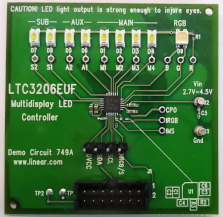
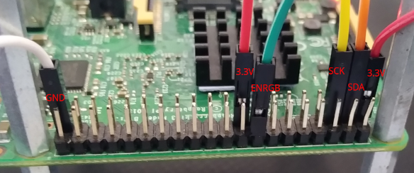
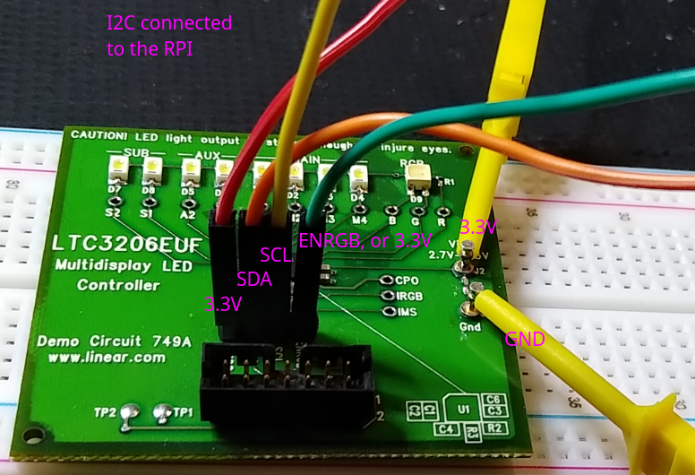
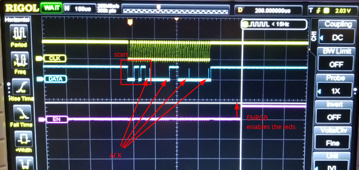
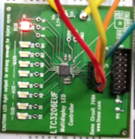
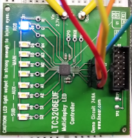
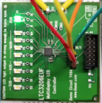
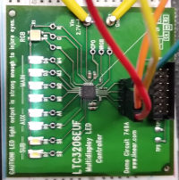
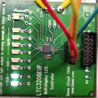

# I2C Client: Multidisplay LED Demo


## Hardware: LTC3206 I2C Multidisplay LED Controller

LTC3206 I2C Multidisplay LED (Analog)  
https://www.analog.com/media/en/technical-documentation/data-sheets/3206f.pdf

DC749A Demo Board (Analog)  
https://www.analog.com/media/en/technical-documentation/user-guides/dc749A.pdf

  

### Connect
use the connector J20  
- GPIO02 [03]  -> SDA
- GPIO03 [05]  -> SCL
- GPIO23 [16]  -> ENRGB  ; optional, alternatively connect to a free 3.3V IO
- 3.3V   [01]  -> DVCC

aside the connector, connect on J2  
- 3.3V   [17]  -> 3.3V VIN
- GND    [39]  -> GND

  
  

| start |   |   |   |   |   |   |   |     | red | r  | r  | r  | x1) | x2) | x3) | x4) |     | blue | b  | b  | b  | green | g  | g  | g  |     | main | m  | m  | m  | sub | s  | s  | s  |     |  
|-------|---|---|---|---|---|---|---|-----|-----|----|----|----|-----|-----|-----|-----|-----|------|----|----|----|-------|----|----|----|-----|------|----|----|----|-----|----|----|----|-----|  
| 0     | 0 | 0 | 1 | 1 | 0 | 1 | 1 | ACK | A7  | A6 | A5 | A4 | A3  | A2  | A1  | A0  | ACK | B7   | B6 | B5 | B4 | B3    | B2 | B1 | B0 | ACK | C7   | C6 | C5 | C4 | C3  | C2 | C1 | C0 | ACK |  

- x1) force charge pump
- x2) ensub ENRGB
- x3) AUXSEL1
- x4) AUXSEL0

(for further details consult the datasheet)  

NB: Make sure the LTC3206 has a fixed address of (actually) 0x36. On my RPI setup, it was shifted to be **0x1B**  
  

NB: The device only will show up if it is correctly powered. The figure out the correct address, first load the module _i2c-dev_, then use i2cdetect  
```
root@ctrl001:/home/pi# i2cdetect -y 1
     0  1  2  3  4  5  6  7  8  9  a  b  c  d  e  f
00:                         -- -- -- -- -- -- -- --
10: -- -- -- -- -- -- -- -- -- -- -- 1b -- -- -- --
20: -- -- -- -- -- -- -- -- -- -- -- -- -- -- -- --
30: -- -- -- -- -- -- -- -- -- -- -- -- -- -- -- --
40: -- -- -- -- -- -- -- -- -- -- -- -- -- -- -- --
50: -- -- -- -- -- -- -- -- -- -- -- -- -- -- -- --
60: -- -- -- -- -- -- -- -- -- -- -- -- -- -- -- --
70: -- -- -- -- -- -- -- --
```
NB: The ENRGB has to be high, either connect it to e.g. GPIO23 [16], export it and set it to '1'. Alternatively, connect it direcly to 3.3V. A better solution would be to export it either by DT overlay or enable it throught the driver.  

# Build

## Devicetree

copy it to the specified location in the linux sources (6.3), then build it  
```
$ cd linux
$ cp -arf <SOURCES>/devicetree/arch ./
$ find . -name \*.dtb -delete
$ make dtbs
  DTC     arch/arm64/boot/dts/broadcom/bcm2710-rpi-3-b.dtb
```
Copy the file `bcm2710-rpi-3-b.dtb` to the target overwriting the `/boot/bcm2710-rpi-3-b.dtb`. In case make a safety backup first.  


## Module

Should crosscompile - having crossbuild-essentials-arm64 installed, ARCH, and CROSS_COMPILE set, execute  
```
$ cd ./module
$ make
```
Copy the module over to the target  

## Usage
```
root@ctrl001:/home/pi# insmod ./i2c_ltc3206euf.ko
root@ctrl001:/home/pi# ls -l /sys/class/leds
    total 0
    lrwxrwxrwx 1 root root 0 Oct 22 21:12 blue -> ../../devices/platform/soc/3f804000.i2c/i2c-1/1-001b/leds/blue
    lrwxrwxrwx 1 root root 0 Oct 22 16:17 default-on -> ../../devices/virtual/leds/default-on
    lrwxrwxrwx 1 root root 0 Oct 22 21:12 green -> ../../devices/platform/soc/3f804000.i2c/i2c-1/1-001b/leds/green
    lrwxrwxrwx 1 root root 0 Oct 22 21:12 main -> ../../devices/platform/soc/3f804000.i2c/i2c-1/1-001b/leds/main
    lrwxrwxrwx 1 root root 0 Oct 22 16:17 mmc0 -> ../../devices/virtual/leds/mmc0
    lrwxrwxrwx 1 root root 0 Oct 22 21:12 red -> ../../devices/platform/soc/3f804000.i2c/i2c-1/1-001b/leds/red
    lrwxrwxrwx 1 root root 0 Oct 22 21:12 sub -> ../../devices/platform/soc/3f804000.i2c/i2c-1/1-001b/leds/sub
```
color led: red (0 = off, 15 = max)  
```
root@ctrl001:/home/pi# echo 10 > /sys/class/leds/red/brightness
root@ctrl001:/home/pi# echo 15 > /sys/class/leds/red/brightness
root@ctrl001:/home/pi# echo 0 > /sys/class/leds/red/brightness
```
  

color led: blue  
```
root@ctrl001:/home/pi# echo 10 > /sys/class/leds/blue/brightness
root@ctrl001:/home/pi# echo 15 > /sys/class/leds/blue/brightness
root@ctrl001:/home/pi# echo 0 > /sys/class/leds/blue/brightness
```
  

color led: green  
```
root@ctrl001:/home/pi# echo 10 > /sys/class/leds/green/brightness
root@ctrl001:/home/pi# echo 15 > /sys/class/leds/green/brightness
root@ctrl001:/home/pi# echo 0 > /sys/class/leds/green/brightness
```
  

main led group  
```
root@ctrl001:/home/pi# echo 10 > /sys/class/leds/main/brightness
root@ctrl001:/home/pi# echo 15 > /sys/class/leds/main/brightness
root@ctrl001:/home/pi# echo 0 > /sys/class/leds/main/brightness
```
  

sub led group  
```
root@ctrl001:/home/pi# echo 10 > /sys/class/leds/sub/brightness
root@ctrl001:/home/pi# echo 15 > /sys/class/leds/sub/brightness
root@ctrl001:/home/pi# echo 0 > /sys/class/leds/sub/brightness
```
  

e.g. mixing color led, and unloading the module  
```
root@ctrl001:/home/pi# echo 15 > /sys/class/leds/red/brightness
root@ctrl001:/home/pi# echo 15 > /sys/class/leds/blue/brightness
root@ctrl001:/home/pi# echo 15 > /sys/class/leds/green/brightness

root@ctrl001:/home/pi# rmmod i2c_ltc3206euf.ko
```

## References
* Linux Driver Development for Embedded Procesesors, A. L. Rios, 2018, p. 246  
