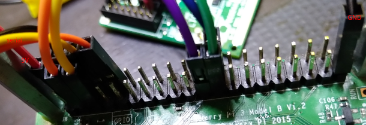

# DC934a - Subsystem DAC / ADC

Provide a driver for the dual DAC LTC2607 (I2C). Then read the analog
outputs from the DAC device by the ADC LTC2422 (SPI). The LTC2607 DAC
outputs are connected to both LTC2422 ADC inputs.  

IIO subsystem ADC with hardware triggering - the ltc2422-dual-adc
driver will be started using a hardware trigger.  

Further the HW Button will be used to generate the HW trigger. After
the button is pressed the results will be available for the userspace
application.  

#### DAC LTC2607

The LTC2607 is a dual 12-bit, 2.7V to 5.5V rail-to-rail voltage output
DAC. It uses a 2-wire, I2C compatible serial interface. The LTC2607
operates in both the standard mode (clock rate of 100kHz) and the fast
mode (clock rate of 400kHz).  

The driver will control each LtC2607 internal DAC individually or both
DACa + DACb in a simultaneous mode. The IIO framework will generate
three separate sysfs files (attributes) used for sending data to the
dual DAC from the user space application.  

#### ADC LTC2422

The LTC2422 Analog device is a 2-channel 2.7V to 5.5V micropower
20-bit analogt-to-digital converter with an integrated oscillator,
8ppm INL and 1.2ppm RMS noise. The device uses delta-sigma technology
and a new digital filter architecture that settles in a single
cycle. This eliminates the latency found in conventional sigma delta
converters and simplifies multiplexed applications. The converter
accepts an external reference voltage from 0.1V to VCC.  


## Hardware: Eval Board dc934a

DC934a Eval Board: https://www.analog.com/en/design-center/evaluation-hardware-and-software/evaluation-boards-kits/dc934a.html

  

#### Modification:
Solder out the device _U7_ from the DC934A board and also the LTC2607 I2C pull-up resistors: _R10_ and _R11_  

  
  

#### Connection:
- 5V -> V+ (connector j1: 1)
- GND -> GND
- GPIO02 (i2c SDA) -> SDA [LTC2607/DAC on the DC934a]
- GPIO03 (i2c SCL) -> SCL
- GPIO08 (SPI_CE0_N) -> CS [LTC2422/ADC on the DC934a]
- GPIO11 (SPI_SCLK) -> SCK
- GPIO09 (SPI_MISO) -> MISO
- GPIO23 -> INT [Button-R-Click Board]
- 3.3V -> 3.3V [Button-R-Click Board]
- GND -> GND [Button-R-Click Board]

#### Jumpers:
Use the device's LT1790ACS6-5 5V output (see _U3_ in schema) as the VREF, i.e.  
- jumper _JP1 VREFA_ to _5V_
- jumper _JP2_ to 5V REF
- jumper _JP5_ to _REFLO_
- jumper _JP4_, _JP6_, _JP7_ to VCC (connect 1 with middle), to configure the address i.e. CA0, CA1, CA2 are set to VCC, this matches with the next I2C slave address 0x72

NB: Using the 5V regulator (_5V REG_ in _JP2_) as the source for VCC
has the limitation that VCC may be slightly lower than VREF, which may
affect the full-scale error. Selecting the 5V REF as the source for
VCC overcomes this, however the total current that the LTC2607 can
source will be limited approximately 5mA.  

  
  

TODO: pic of setup with HW Button         


# Build

## Devicetree

Copy it to the specified location in the linux sources, then build it  
```
$ cd linux
$ cp -arf <SOURCES>/devicetree/arch ./
$ find . -name \*.dtb -delete
$ make dtbs
  DTC     arch/arm64/boot/dts/broadcom/bcm2710-rpi-3-b.dtb
```
Copy the file `bcm2710-rpi-3-b.dtb` to the target overwriting the `/boot/bcm2710-rpi-3-b.dtb`. In case make a safety backup first.  

## Module

Having crossbuild-essentials-arm64 installed, `ARCH`, and `CROSS_COMPILE` set, execute  
```
$ cd ./module__ltc2422-hw-trigger
$ make

$ cd -

$ cd ./module__ltc2607-dual-dac
$ make
```
Copy the module over to the target  

NB: In case the module won't compile (or `make clean` fails) due to the symlink, enter the directory on the absolute path, not the linked path.  

## Userspace
Compile cross, then copy the .elf over to the target.   
```
rpi$ cd ./userspace__ltc2422-adc
rpi$ make
```

## Usage

See the connected Accel Click appears on `1d` (i2c).  
```
$ sudo su
# modprobe i2c-dev
# modprobe industrialio

# insmod ./iio-ltc2607-dac.ko
# insmod ./iio-ltc2422-adc.ko
# ls -l /sys/bus/iio/devices/
    total 0
    lrwxrwxrwx 1 root root 0 Jan  5 23:23 iio:device0 -> ../../../devices/platform/soc/3f804000.i2c/i2c-1/1-0072/iio:device0
    lrwxrwxrwx 1 root root 0 Jan  5 23:23 iio:device1 -> ../../../devices/platform/soc/3f804000.i2c/i2c-1/1-0073/iio:device1
    lrwxrwxrwx 1 root root 0 Jan  5 23:23 iio:device2 -> ../../../devices/platform/soc/3f204000.spi/spi_master/spi0/spi0.0/iio:device2

# echo 65535 > /sys/bus/iio/devices/iio\:device1/out_voltage2_raw

# ./iio_app.elf                       <--- in the following press the button 3x
    the value of the ADC channel 1
    	is : 3.7287
    the value of the ADC channel 0
    	is : 3.7226
    READY.

# rmmod iio-ltc2607-dac.ko
# rmmod iio-ltc2422-adc.ko
```

Follow the logs   
```
Jan  5 23:21:29 ctrl001 kernel: [  120.674231] i2c_dev: i2c /dev entries driver

Jan  5 23:22:05 ctrl001 kernel: [  156.447807] iio_ltc2607_dac: loading out-of-tree module taints kernel.
Jan  5 23:22:05 ctrl001 kernel: [  156.449196] ltc2607 1-0072: ltc2607_probe() - called
Jan  5 23:22:05 ctrl001 kernel: [  156.449266] ltc2607 1-0072: ltc2607_probe() - was called from DAC00
Jan  5 23:22:05 ctrl001 kernel: [  156.450070] ltc2607 1-0072: ltc2607_probe() - the DAC answer is '3'
Jan  5 23:22:05 ctrl001 kernel: [  156.450534] ltc2607 1-0072: ltc2607_probe() - ltc2607 DAC registered
Jan  5 23:22:05 ctrl001 kernel: [  156.451052] ltc2607 1-0073: ltc2607_probe() - called
Jan  5 23:22:05 ctrl001 kernel: [  156.451108] ltc2607 1-0073: ltc2607_probe() - was called from DAC01
Jan  5 23:22:05 ctrl001 kernel: [  156.452176] ltc2607 1-0073: ltc2607_probe() - the DAC answer is '3'
Jan  5 23:22:05 ctrl001 kernel: [  156.452677] ltc2607 1-0073: ltc2607_probe() - ltc2607 DAC registered

Jan  5 23:22:23 ctrl001 kernel: [  174.759118] ltc2422 spi0.0: ltc2422_probe() - called
Jan  5 23:22:23 ctrl001 kernel: [  174.759336] ltc2422 spi0.0: ltc2422_probe() - the irq number is '185;

Jan  5 23:28:42 ctrl001 kernel: [  553.575933] ltc2422 spi0.0: ltc2422_read_raw() - called
Jan  5 23:28:42 ctrl001 kernel: [  553.575981] ltc2422 spi0.0: ltc2422_read_raw() - press microbus key to start conversion
Jan  5 23:28:42 ctrl001 kernel: [  553.713591] ltc2422 spi0.0: ltc2422_read_raw() - called
Jan  5 23:28:42 ctrl001 kernel: [  553.713631] ltc2422 spi0.0: ltc2422_read_raw() - press microbus key to start conversion
Jan  5 23:28:45 ctrl001 kernel: [  556.736734] ltc2422 spi0.0: ltc2422_read_raw() - called
Jan  5 23:28:45 ctrl001 kernel: [  556.736775] ltc2422 spi0.0: ltc2422_read_raw() - press microbus key to start conversion

Jan  5 23:30:02 ctrl001 kernel: [  633.503189] ltc2607 1-0073: ltc2607_remove() - called
Jan  5 23:30:02 ctrl001 kernel: [  633.506368] ltc2607 1-0072: ltc2607_remove() - called
Jan  5 23:30:08 ctrl001 kernel: [  639.772405] ltc2422 spi0.0: ltc2422_remove() - called
```

## References
* Linux Driver Development for Embedded Procesesors, A. L. Rios, 2018, p. 494ff, 508ff and 540  
