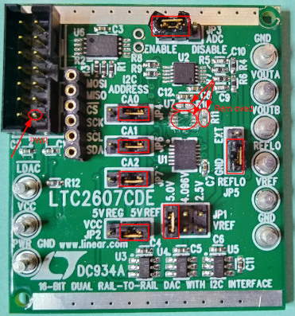
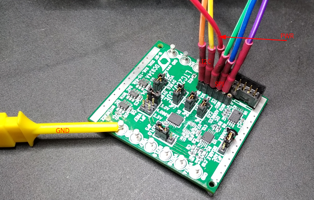

# DC934a - Subsystem DAC (LTC2607)

Provide a driver for the dual DAC LTC2607 (I2C). Then read the analog
outputs from the DAC device by the ADC LTC2422 (SPI). The LTC2607 DAC
outputs are connected to both LTC2422 ADC inputs.  

This setup will use the LTC2607 (I2C) driver, and add another for the
LTC2422 ADC which have two ports. This LTC2422 ADC then will toggle
between first ADC and second ADC.  

#### DAC LTC2607

The LTC2607 is a dual 12-bit, 2.7V to 5.5V rail-to-rail voltage output
DAC. It uses a 2-wire, I2C compatible serial interface. The LTC2607
operates in both the standard mode (clock rate of 100kHz) and the fast
mode (clock rate of 400kHz).  

The driver will control each LtC2607 internal DAC individually or both
DACa + DACb in a simultaneous mode. The IIO framework will generate
three separate sysfs files (attributes) used for sending data to the
dual DAC from the user space application.  


#### ADC LTC2422

The LTC2422 Analog device is a 2-channel 2.7V to 5.5V micropower
20-bit analogt-to-digital converter with an integrated oscillator,
8ppm INL and 1.2ppm RMS noise. The device uses delta-sigma technology
and a new digital filter architecture that settles in a single
cycle. This eliminates the latency found in conventional sigma delta
converters and simplifies multiplexed applications. The converter
accepts an external reference voltage from 0.1V to VCC.  

The LTC2422 serial output data stream is 24 bits long. The first 4
bits represent status information indicating the sign, selected
channel, input range and conversion state. the next 20 bits are the
conversion result, MSB first:  

- Bit 23 (first output bit): The end of conversion (EOC)
  indicator. This bit is available at the SDO pin during the
  conversion and sleep states whenever the CS pin is LOW. This bit
  is HIGH during the conversion and goes LOw when the conversion is
  complete.
- Bit 22 (second output bit): for the LtC2422, this bit is LOW if
  the last conversion was performed on CH0 and HIGH for CH1. This
  bit is always LOW for the LTC2422
- Bit 21 (third output bit): The conversion result sign indicator
  (SIG). If VIN is > 0, this bit is HIGH. If VIN is <0, this bit is
  LOW. The sign bit changes state during the zero code.
- Bit 20 (fourth output bit): The extended input range (EXR)
  indicator. If the input is within the normal input range 0 <= VIN
  <= VREF, this bit is LOW. If the input is outside the normal input
  range, VIN > VREF or VIN < 0, this bit is HIGH.
- Bit 19 (fifth output bit): The most significant bit (MSB).
- Bits 19-0: The 20 bit conversion result MSB first.
- Bit 0: The last significant bit (LSB).

## Hardware: Eval Board dc934a

DC934a Eval Board: https://www.analog.com/en/design-center/evaluation-hardware-and-software/evaluation-boards-kits/dc934a.html

  

#### Modification:
Solder out the device _U7_ from the DC934A board and also the LTC2607 I2C pull-up resistors: _R10_ and _R11_  

  
  

#### Connection:
- 5V -> V+ (connector j1: 1)
- GND -> GND
- GPIO02 (i2c SDA) -> SDA [LTC2607/DAC on the DC934a]
- GPIO03 (i2c SCL) -> SCL
- GPIO08 (SPI_CE0_N) -> CS [LTC2422/ADC on the DC934a]
- GPIO11 (SPI_SCLK) -> SCK
- GPIO09 (SPI_MISO) -> MISO

#### Jumpers:
Use the device's LT1790ACS6-5 5V output (see _U3_ in schema) as the VREF, i.e.  
- jumper _JP1 VREFA_ to _5V_
- jumper _JP2_ to 5V REF
- jumper _JP5_ to _REFLO_
- jumper _JP4_, _JP6_, _JP7_ to VCC (connect 1 with middle), to configure the address i.e. CA0, CA1, CA2 are set to VCC, this matches with the next I2C slave address 0x72

NB: Using the 5V regulator (_5V REG_ in _JP2_) as the source for VCC
has the limitation that VCC may be slightly lower than VREF, which may
affect the full-scale error. Selecting the 5V REF as the source for
VCC overcomes this, however the total current that the LTC2607 can
source will be limited approximately 5mA.  

  
  

# Build

## Devicetree

Copy it to the specified location in the linux sources, then build it  
```
$ cd linux
$ cp -arf <SOURCES>/devicetree/arch ./
$ find . -name \*.dtb -delete
$ make dtbs
  DTC     arch/arm64/boot/dts/broadcom/bcm2710-rpi-3-b.dtb
```
Copy the file `bcm2710-rpi-3-b.dtb` to the target overwriting the `/boot/bcm2710-rpi-3-b.dtb`. In case make a safety backup first.  

## Module

Having crossbuild-essentials-arm64 installed, `ARCH`, and `CROSS_COMPILE` set, execute  
```
$ cd ./module__ltc2422-dual-adc
$ make

$ cd -

$ cd ./module__ltc2607-dual-dac
$ make
```
Copy the module over to the target  

NB: In case the module won't compile (or `make clean` fails) due to the symlink, enter the directory on the absolute path, not the linked path.  

## Userspace
Compile cross, then copy the .elf over to the target.   
```
rpi$ cd ./userspace__ltc2422-adc
rpi$ make
```

## Usage

See the connected Accel Click appears on `1d` (i2c).  
```
$ sudo su
# modprobe i2c-dev
# modprobe industrialio

# insmod ./iio-ltc2607-dac.ko
# insmod ./iio-ltc2422-adc.ko

# ls -l /sys/bus/iio/devices/
    total 0
    lrwxrwxrwx 1 root root 0 Jan  3 22:38 iio:device0 -> ../../../devices/platform/soc/3f804000.i2c/i2c-1/1-0072/iio:device0
    lrwxrwxrwx 1 root root 0 Jan  3 22:38 iio:device1 -> ../../../devices/platform/soc/3f804000.i2c/i2c-1/1-0073/iio:device1
    lrwxrwxrwx 1 root root 0 Jan  3 22:38 iio:device2 -> ../../../devices/platform/soc/3f204000.spi/spi_master/spi0/spi0.0/iio:device2

# ls -l /sys/bus/iio/devices/iio\:device2/
    total 0
    -r--r--r-- 1 root root 4096 Jan  3 22:38 name
    lrwxrwxrwx 1 root root    0 Jan  3 22:38 of_node -> ../../../../../../../../firmware/devicetree/base/soc/spi@7e204000/ltc2422@0
    -rw-r--r-- 1 root root 4096 Jan  3 22:38 out_voltage0_raw
    drwxr-xr-x 2 root root    0 Jan  3 22:38 power
    lrwxrwxrwx 1 root root    0 Jan  3 22:38 subsystem -> ../../../../../../../../bus/iio
    -rw-r--r-- 1 root root 4096 Jan  3 22:38 uevent
    -r--r--r-- 1 root root 4096 Jan  3 22:38 waiting_for_supplier

# echo 65535 > /sys/bus/iio/devices/iio\:device1/out_voltage2_raw
# ./iio_app.elf
    the value of the ADC channel 0
    	is : 4.9916
    the value of the ADC channel 1
    	is : 4.9938
    READY.

# echo 0 > /sys/bus/iio/devices/iio\:device1/out_voltage0_raw
# ./iio_app.elf
    the value of the ADC channel 1
    	is : 0.0011
    the value of the ADC channel 0
    	is : 4.9915
    READY.

# echo 0 > /sys/bus/iio/devices/iio\:device1/out_voltage1_raw
# ./iio_app.elf
    the value of the ADC channel 0
    	is : 0.0008
    the value of the ADC channel 1
    	is : 0.0011
    READY.

# echo 65535 > /sys/bus/iio/devices/iio\:device1/out_voltage2_raw
# ./iio_app.elf
    the value of the ADC channel 1
    	is : 4.9938
    the value of the ADC channel 0
    	is : 4.9914
    READY.
```

Note: Reading the channel will toggle around both ADC channels, i.e. Read first ADC channel, then read second, then again read first, and so on  
```
# cat /sys/bus/iio/devices/iio\:device2/out_voltage0_raw
    7338711

# cat /sys/bus/iio/devices/iio\:device2/out_voltage0_raw
    3143929
# cat /sys/bus/iio/devices/iio\:device2/out_voltage0_raw
    7338706
# cat /sys/bus/iio/devices/iio\:device2/out_voltage0_raw
    3143970
# cat /sys/bus/iio/devices/iio\:device2/out_voltage0_raw
    7338674
# cat /sys/bus/iio/devices/iio\:device2/out_voltage0_raw
    3143968

# rmmod iio-ltc2607-dac.ko
# rmmod iio-ltc2422-adc.ko
```

Logs  
```
Jan  7 18:03:17 ctrl001 kernel: [   59.854867] i2c_dev: i2c /dev entries driver

Jan  7 18:03:43 ctrl001 kernel: [   85.432157] iio_ltc2607_dac: loading out-of-tree module taints kernel.
Jan  7 18:03:43 ctrl001 kernel: [   85.433468] ltc2607 1-0072: ltc2607_probe() - called
Jan  7 18:03:43 ctrl001 kernel: [   85.433524] ltc2607 1-0072: ltc2607_probe() - was called from DAC00
Jan  7 18:03:43 ctrl001 kernel: [   85.434226] ltc2607 1-0072: ltc2607_probe() - the DAC answer is '3'
Jan  7 18:03:43 ctrl001 kernel: [   85.434654] ltc2607 1-0072: ltc2607_probe() - ltc2607 DAC registered
Jan  7 18:03:43 ctrl001 kernel: [   85.435791] ltc2607 1-0073: ltc2607_probe() - called
Jan  7 18:03:43 ctrl001 kernel: [   85.435848] ltc2607 1-0073: ltc2607_probe() - was called from DAC01
Jan  7 18:03:43 ctrl001 kernel: [   85.436560] ltc2607 1-0073: ltc2607_probe() - the DAC answer is '3'
Jan  7 18:03:43 ctrl001 kernel: [   85.437247] ltc2607 1-0073: ltc2607_probe() - ltc2607 DAC registered

Jan  7 18:03:51 ctrl001 kernel: [   93.081574] ltc2422 spi0.0: ltc2422_probe() - called

Jan  7 18:06:49 ctrl001 kernel: [  271.035299] ltc2607 1-0073: ltc2607_write_raw() - called
Jan  7 18:06:49 ctrl001 kernel: [  271.035348] ltc2607 1-0073: ltc2607_write_raw() - case IIO_CHAN_INFO_RAW: val '65535', chan->channel '2'
Jan  7 18:06:49 ctrl001 kernel: [  271.035381] ltc2607 1-0073: ltc2607_set_value() - called
Jan  7 18:06:49 ctrl001 kernel: [  271.035406] ltc2607 1-0073: ltc2607_set_value() - val '65535', channel '2'
Jan  7 18:06:49 ctrl001 kernel: [  271.035433] ltc2607 1-0073: ltc2607_set_value() - chan '0f' [0x00: DACa, 0x01: DACb, 0x0f: both DACs]
Jan  7 18:06:49 ctrl001 kernel: [  271.035462] ltc2607 1-0073: ltc2607_set_value() - outbuf[0] '3f'
Jan  7 18:06:49 ctrl001 kernel: [  271.035487] ltc2607 1-0073: ltc2607_set_value() - outbuf[1] 'ff'
Jan  7 18:06:49 ctrl001 kernel: [  271.035512] ltc2607 1-0073: ltc2607_set_value() - outbuf[2] 'ff'

Jan  7 18:08:15 ctrl001 kernel: [  357.813004] ltc2422 spi0.0: ltc2422_read_raw() - called
Jan  7 18:08:15 ctrl001 kernel: [  357.813109] ltc2422 spi0.0: the value is 6ffad9
Jan  7 18:08:15 ctrl001 kernel: [  357.950697] ltc2422 spi0.0: ltc2422_read_raw() - called
Jan  7 18:08:15 ctrl001 kernel: [  357.950797] ltc2422 spi0.0: the value is 2ff914
Jan  7 18:08:16 ctrl001 kernel: [  358.088753] ltc2422 spi0.0: ltc2422_read_raw() - called
Jan  7 18:08:16 ctrl001 kernel: [  358.088857] ltc2422 spi0.0: the value is 6ffae5

Jan  7 18:10:00 ctrl001 kernel: [  462.921040] ltc2607 1-0073: ltc2607_write_raw() - called
Jan  7 18:10:00 ctrl001 kernel: [  462.921086] ltc2607 1-0073: ltc2607_write_raw() - case IIO_CHAN_INFO_RAW: val '0', chan->channel '0'
Jan  7 18:10:00 ctrl001 kernel: [  462.921117] ltc2607 1-0073: ltc2607_set_value() - called
Jan  7 18:10:00 ctrl001 kernel: [  462.921142] ltc2607 1-0073: ltc2607_set_value() - val '0', channel '0'
Jan  7 18:10:00 ctrl001 kernel: [  462.921169] ltc2607 1-0073: ltc2607_set_value() - chan '00' [0x00: DACa, 0x01: DACb, 0x0f: both DACs]
Jan  7 18:10:00 ctrl001 kernel: [  462.921196] ltc2607 1-0073: ltc2607_set_value() - outbuf[0] '30'
Jan  7 18:10:00 ctrl001 kernel: [  462.921222] ltc2607 1-0073: ltc2607_set_value() - outbuf[1] '00'
Jan  7 18:10:00 ctrl001 kernel: [  462.921247] ltc2607 1-0073: ltc2607_set_value() - outbuf[2] '00'

Jan  7 18:10:41 ctrl001 kernel: [  503.991916] ltc2422 spi0.0: ltc2422_read_raw() - called
Jan  7 18:10:41 ctrl001 kernel: [  503.992019] ltc2422 spi0.0: the value is 2ff901
Jan  7 18:10:42 ctrl001 kernel: [  504.129598] ltc2422 spi0.0: ltc2422_read_raw() - called
Jan  7 18:10:42 ctrl001 kernel: [  504.129693] ltc2422 spi0.0: the value is 6000e3
Jan  7 18:10:42 ctrl001 kernel: [  504.267445] ltc2422 spi0.0: ltc2422_read_raw() - called
Jan  7 18:10:42 ctrl001 kernel: [  504.267531] ltc2422 spi0.0: the value is 2ff910

Jan  7 18:11:15 ctrl001 kernel: [  537.291274] ltc2607 1-0073: ltc2607_write_raw() - called
Jan  7 18:11:15 ctrl001 kernel: [  537.291323] ltc2607 1-0073: ltc2607_write_raw() - case IIO_CHAN_INFO_RAW: val '0', chan->channel '1'
Jan  7 18:11:15 ctrl001 kernel: [  537.291355] ltc2607 1-0073: ltc2607_set_value() - called
Jan  7 18:11:15 ctrl001 kernel: [  537.291378] ltc2607 1-0073: ltc2607_set_value() - val '0', channel '1'
Jan  7 18:11:15 ctrl001 kernel: [  537.291404] ltc2607 1-0073: ltc2607_set_value() - chan '01' [0x00: DACa, 0x01: DACb, 0x0f: both DACs]
Jan  7 18:11:15 ctrl001 kernel: [  537.291431] ltc2607 1-0073: ltc2607_set_value() - outbuf[0] '31'
Jan  7 18:11:15 ctrl001 kernel: [  537.291457] ltc2607 1-0073: ltc2607_set_value() - outbuf[1] '00'
Jan  7 18:11:15 ctrl001 kernel: [  537.291482] ltc2607 1-0073: ltc2607_set_value() - outbuf[2] '00'

Jan  7 18:11:27 ctrl001 kernel: [  549.030776] ltc2422 spi0.0: ltc2422_read_raw() - called
Jan  7 18:11:27 ctrl001 kernel: [  549.030880] ltc2422 spi0.0: the value is 6000de
Jan  7 18:11:27 ctrl001 kernel: [  549.168651] ltc2422 spi0.0: ltc2422_read_raw() - called
Jan  7 18:11:27 ctrl001 kernel: [  549.168743] ltc2422 spi0.0: the value is 2000a6
Jan  7 18:11:27 ctrl001 kernel: [  549.306507] ltc2422 spi0.0: ltc2422_read_raw() - called
Jan  7 18:11:27 ctrl001 kernel: [  549.306605] ltc2422 spi0.0: the value is 6000e0

Jan  7 18:14:03 ctrl001 kernel: [  706.001103] ltc2607 1-0073: ltc2607_write_raw() - called
Jan  7 18:14:03 ctrl001 kernel: [  706.001151] ltc2607 1-0073: ltc2607_write_raw() - case IIO_CHAN_INFO_RAW: val '65535', chan->channel '2'
Jan  7 18:14:03 ctrl001 kernel: [  706.001185] ltc2607 1-0073: ltc2607_set_value() - called
Jan  7 18:14:03 ctrl001 kernel: [  706.001209] ltc2607 1-0073: ltc2607_set_value() - val '65535', channel '2'
Jan  7 18:14:03 ctrl001 kernel: [  706.001236] ltc2607 1-0073: ltc2607_set_value() - chan '0f' [0x00: DACa, 0x01: DACb, 0x0f: both DACs]
Jan  7 18:14:03 ctrl001 kernel: [  706.001263] ltc2607 1-0073: ltc2607_set_value() - outbuf[0] '3f'
Jan  7 18:14:03 ctrl001 kernel: [  706.001288] ltc2607 1-0073: ltc2607_set_value() - outbuf[1] 'ff'
Jan  7 18:14:03 ctrl001 kernel: [  706.001314] ltc2607 1-0073: ltc2607_set_value() - outbuf[2] 'ff'

Jan  7 18:14:08 ctrl001 kernel: [  710.357507] ltc2422 spi0.0: ltc2422_read_raw() - called
Jan  7 18:14:08 ctrl001 kernel: [  710.357612] ltc2422 spi0.0: the value is 2000a4
Jan  7 18:14:08 ctrl001 kernel: [  710.495224] ltc2422 spi0.0: ltc2422_read_raw() - called
Jan  7 18:14:08 ctrl001 kernel: [  710.495310] ltc2422 spi0.0: the value is 6ffae3
Jan  7 18:14:08 ctrl001 kernel: [  710.633074] ltc2422 spi0.0: ltc2422_read_raw() - called
Jan  7 18:14:08 ctrl001 kernel: [  710.633157] ltc2422 spi0.0: the value is 2ff8fd
```

Logs: the single direct reads from the ADC handles
```
Jan  7 18:15:25 ctrl001 kernel: [  787.195846] ltc2422 spi0.0: ltc2422_read_raw() - called
Jan  7 18:15:25 ctrl001 kernel: [  787.195947] ltc2422 spi0.0: the value is 6ffad7
Jan  7 18:15:31 ctrl001 kernel: [  793.461727] ltc2422 spi0.0: ltc2422_read_raw() - called
Jan  7 18:15:31 ctrl001 kernel: [  793.461828] ltc2422 spi0.0: the value is 2ff8f9
Jan  7 18:15:33 ctrl001 kernel: [  795.963200] ltc2422 spi0.0: ltc2422_read_raw() - called
Jan  7 18:15:33 ctrl001 kernel: [  795.963265] ltc2422 spi0.0: the value is 6ffad2
Jan  7 18:15:34 ctrl001 kernel: [  796.773725] ltc2422 spi0.0: ltc2422_read_raw() - called
Jan  7 18:15:34 ctrl001 kernel: [  796.773796] ltc2422 spi0.0: the value is 2ff922
Jan  7 18:15:35 ctrl001 kernel: [  797.954156] ltc2422 spi0.0: ltc2422_read_raw() - called
Jan  7 18:15:35 ctrl001 kernel: [  797.954223] ltc2422 spi0.0: the value is 6ffab2
Jan  7 18:15:36 ctrl001 kernel: [  798.600397] ltc2422 spi0.0: ltc2422_read_raw() - called
Jan  7 18:15:36 ctrl001 kernel: [  798.600461] ltc2422 spi0.0: the value is 2ff920

Jan  7 18:16:33 ctrl001 kernel: [  855.807562] ltc2607 1-0073: ltc2607_remove() - called
Jan  7 18:16:33 ctrl001 kernel: [  855.807891] ltc2607 1-0072: ltc2607_remove() - called
```

## References
* Linux Driver Development for Embedded Procesesors, A. L. Rios, 2018, p. 494ff, 508ff and 529  
