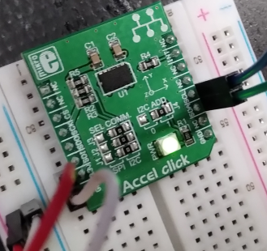

# DMA from user space

Use the ADXL345 Accel click mikroBUS accessory board connected to the
I2C bus of the processor to verify the driver. The driver will scan
periodially the value of one of the accelerometer axes, and depending
on the tilt of the board, it will generate an event that is exposed to
the application `evtest`. The accelerometer kernel module will use the
polled input subclass. A polled input device provides a skeleton for
supporting simple input devices that do not raise interrupts, but have
to be periodically scanned or polled to detect changes in their state.  

This is the SPI version of the demo.  

## Hardware

- ADXL345 Accel click mikroBUS: https://www.mikroe.com/accel-spi-board

  

Connection (RPI3b to ADXL345):  
- SPI_CE0_N (pin 24) -> CS
- SPI_SCLK (pin 23) -> SCK
- SPI_MISO (pin 21) -> SDO
- SPI_MOSI (pin 19) -> SDI
- GPIO23 (pin 16) -> INT
- 3v3 -> 3v3
- GND -> GND

# Build

## Devicetree

Copy it to the specified location in the linux sources, then build it  
```
$ cd linux
$ cp -arf <SOURCES>/devicetree/arch ./
$ find . -name \*.dtb -delete
$ make dtbs
  DTC     arch/arm64/boot/dts/broadcom/bcm2710-rpi-3-b.dtb
```
Copy the file `bcm2710-rpi-3-b.dtb` to the target overwriting the `/boot/bcm2710-rpi-3-b.dtb`. In case make a safety backup first.  

## Module

Having crossbuild-essentials-arm64 installed, ARCH, and CROSS_COMPILE set, execute  
```
$ cd ./module
$ make
```
Copy the module over to the target  

## Usage

```
$ sudo su
# modprobe spi-gpio

# cd /sys/class/input/input6/device/
# ls
TODO    
```

read the three axes values  
```
# cat read  
TODO    
```

move the accel board and read again  
```
# cat read
TODO    
```

read the data rate, and change the data rate  
```
# cat rate
# echo 10 > rate
```

run `evtest` and move the board to generate accelerometer data  
```
# evtest <TODO device>
TODO    
^C
# rmmod input_demo.ko
```

Follow the logs   
```
TODO    
```

## TODO

- SPI communication is broken: SPI does not seem to find it's counterpart


## References
* Linux Driver Development for Embedded Procesesors, A. L. Rios, 2018, p. 446  
