# Notes on PIC32MX470 Curiosity Board

The idea here is not to provide lots of PIC32 demos. It shall just be described how to set it up as counterpart for some of the USB demos.   


## MPLAB X Installation (Linux)

So, this is how I managed to survive MPLAB X IDE installation + 32-bit
Toolchain on my Debian Linux box.  

Select `PIC32MX470512H` of family `PIC32MX`.  

- MPLAB X IDE: https://www.microchip.com/en-us/tools-resources/develop/mplab-x-ide#tabs  
- X32 compiler: https://www.microchip.com/en-us/tools-resources/develop/mplab-xc-compilers/xc32  
- MPLAB X Harmony v3: clone from github  

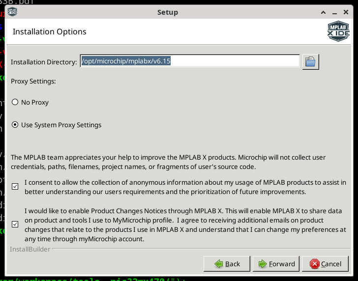  
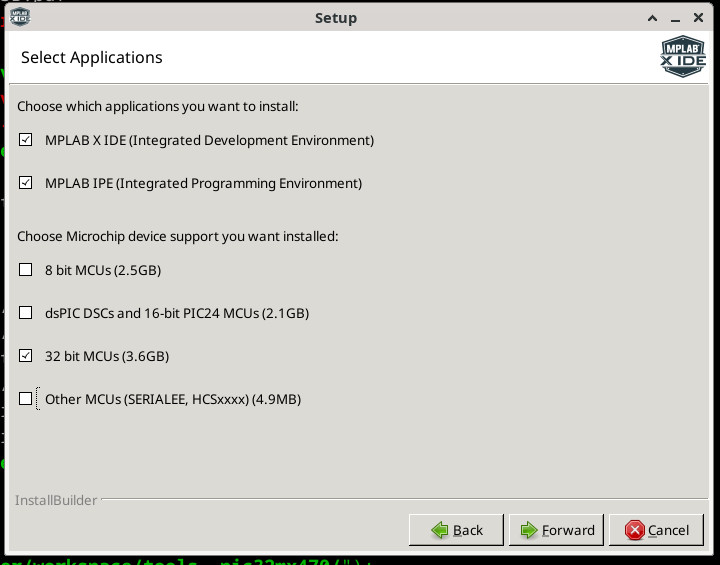  
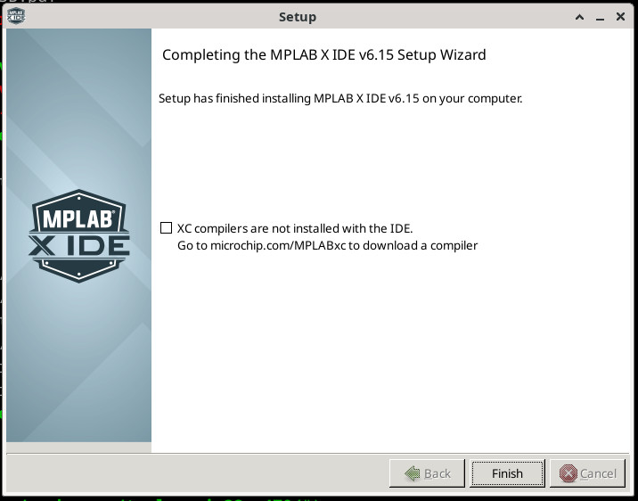  
-> Reboot the PC  
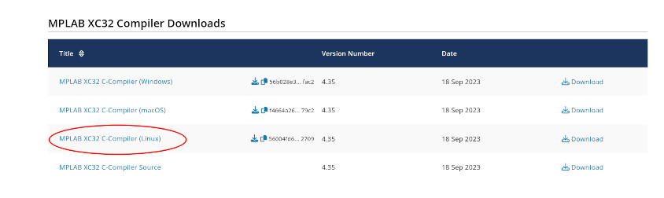  
  

Real fun starts now! After downloading and installing MPLAB X, and a bunch of github repos, you should also install the 32-bit toolchain separately.  

```
$ sudo apt install -y libusb-1.0-0

$ tar xf ./MPLABX-v6.15-linux-installer.tar
$ sudo ./MPLABX-v6.15-linux-installer.sh
-> only select MPLAB X IDE, and
-> PIC32 support
```

#### Install Harmony 3  
```
$ sudo chown <user>:<user> -R /opt/microchip
$ mkdir -p /opt/microchip/harmony && cd $_
$ git clone https://github.com/Microchip-MPLAB-Harmony/mplabx-plugin
```

After the installation here is before installation! I think it was around here where I did the plugin installation as follows:  
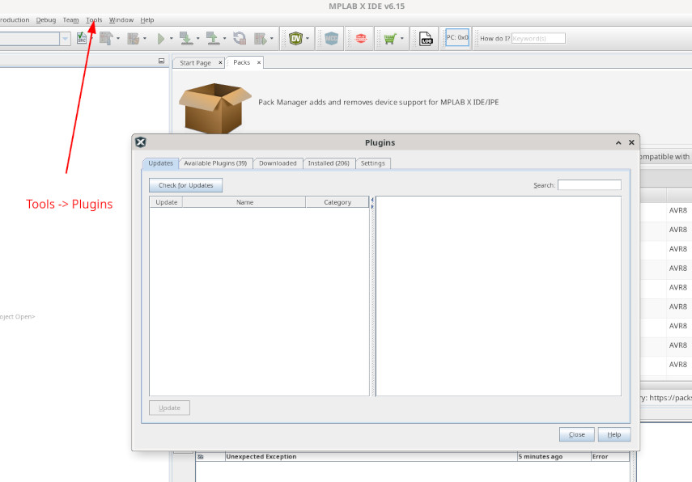  
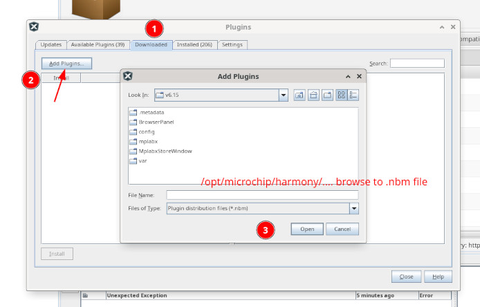  
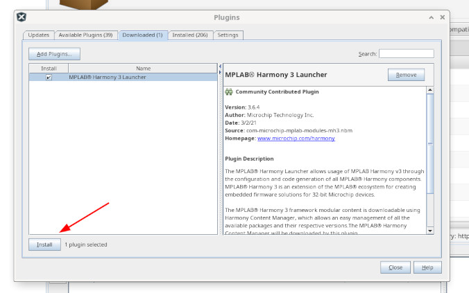  
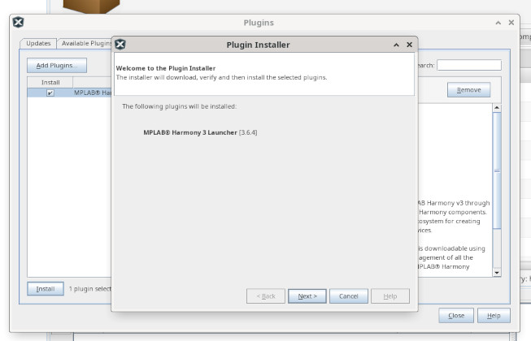  
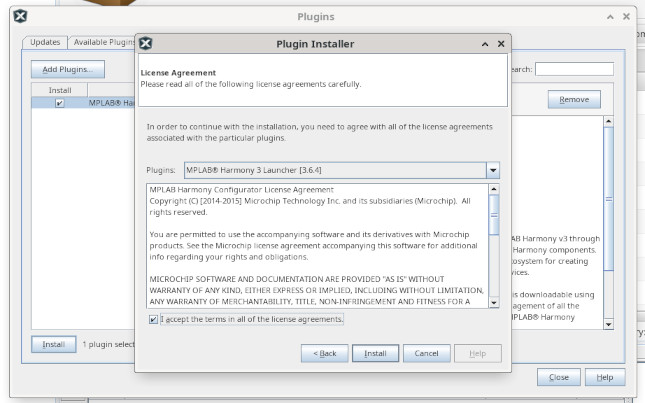  
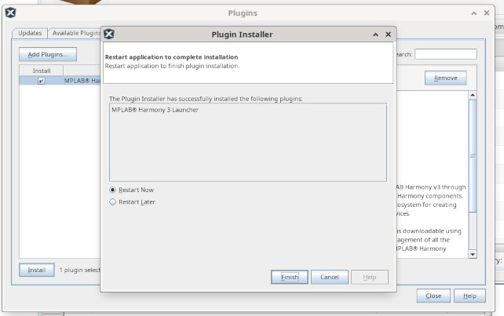  
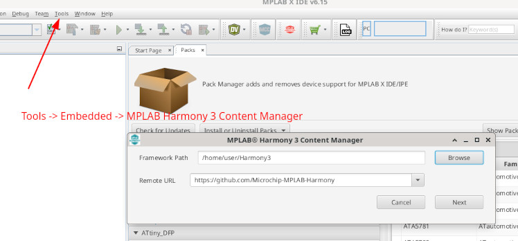  
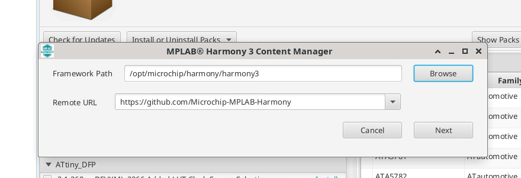  
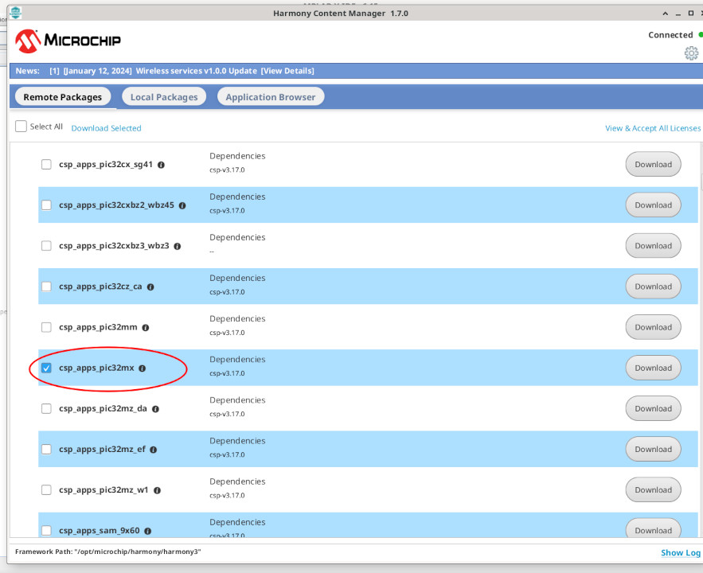  
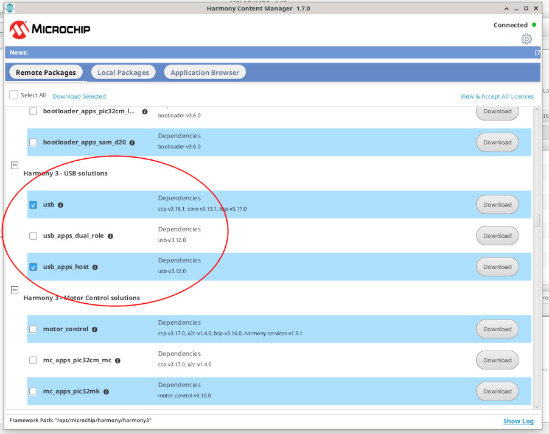  
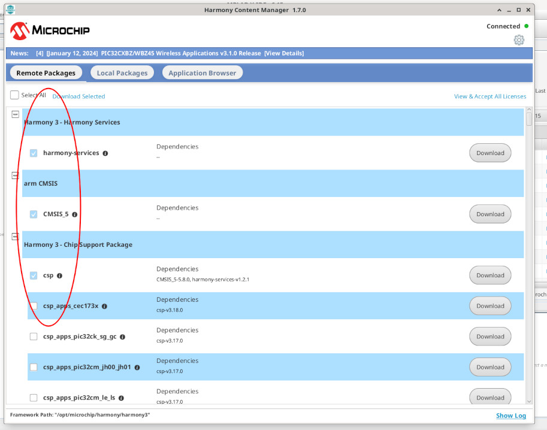  
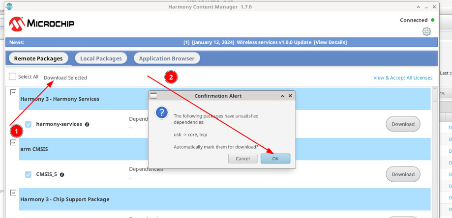  
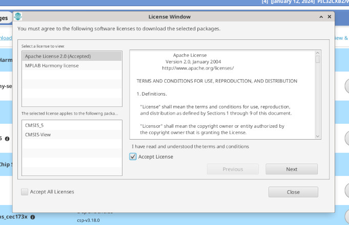  
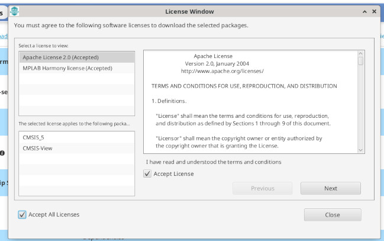  
  
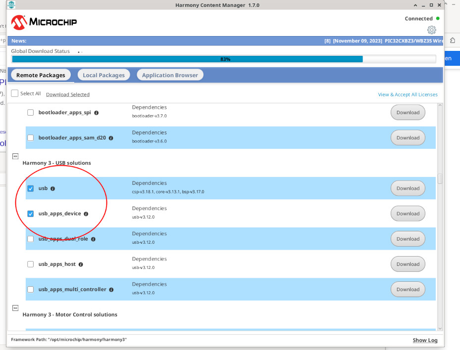  
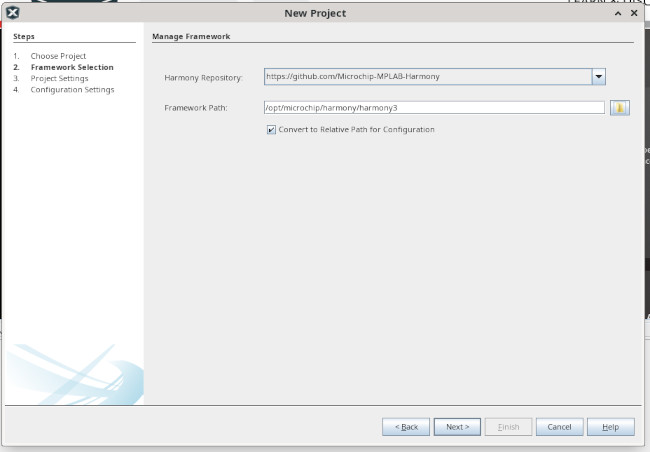  
  
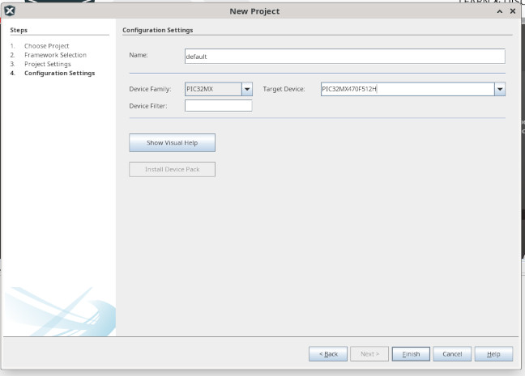  

#### Install the Plugins Setup   

- `Tools -> Plugins -> Downloaded -> Add plugins -> navigate to .nbm file above -> Open -> Install` (with 6.x, I previously found the plugin online under "Available Plugins ")
- `Tools -> Embedded -> MPLAB Harmony 3 Content Manager`
- Download all default packages into a path you choose
- Download `usb` and `usb-device`
- `File -> New Project -> 32 bit MCC Harmony Project` (specify the same path)
- And later, `Tools -> Embedded -> MPLAB Code Configurator v5 Open/Close` (or just click the blue shield icon with MCC)

#### Fix MPLAB X path

For _MPLAB X_ path, clone the MHC stuff into the folling path  
```
$ cd /opt/microchip/harmony/harmony3
$ git clone https://github.com/Microchip-MPLAB-Harmony/mhc.git ./mhc
```
...then select the path to `/opt/microchip/harmony/harmony3` as MPLAB X path, and it should accept it, since the folder `mhc` is around and populated accordingly as subfolder. The MPLAB Content Configuratior (MCC) now should work ...better.  

#### Fix XCLM setuid-root Permissions

Make sure the XCLM is owned by root, and has setuid-bit set. This will prevent a wall of warnings, and not functional toolchain.  
```
$ find ./ -type f -name xclm
    ...
	/opt/microchip/xc32/v4.35/bin/xclm

$ sudo chown root /opt/microchip/xc32/v4.35/bin/xclm
$ sudo chmod 4755 /opt/microchip/xc32/v4.35/bin/xclm
```

#### References: MPLAB X and PIC32MX470  

- Eval board: https://www.microchip.com/en-us/development-tool/dm320103
- Upgrade from "MHC-based MPLAB harmony v3" to "MCC-based project": https://microchipdeveloper.com/xwiki/bin/view/software-tools/harmony/update-and-configure-existing-mhc-proj-to-mcc-proj/
- Getting started with PIC32MX470: https://microchipdeveloper.com/xwiki/bin/view/software-tools/harmony/pic32mx470-getting-started-training-module/
- How to create a new project in MPLAB: https://microchipdeveloper.com/xwiki/bin/view/software-tools/harmony/getting-started-training-module-using-mcc/
- github repo of Microchip's USB code examples: https://github.com/Microchip-MPLAB-Harmony/usb_apps_device/
- Documentation on the USB code examples: https://mplab-discover.microchip.com/v2/category/com.microchip.code.examples/com.microchip.ide.project?dsl=PIC32MX470F512H


## Build and Flash

  
  
