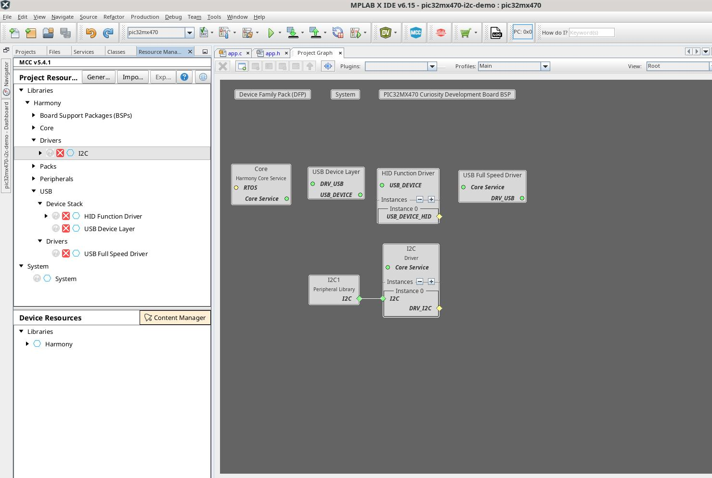
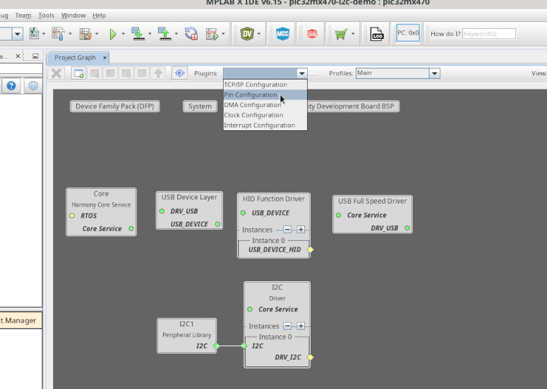
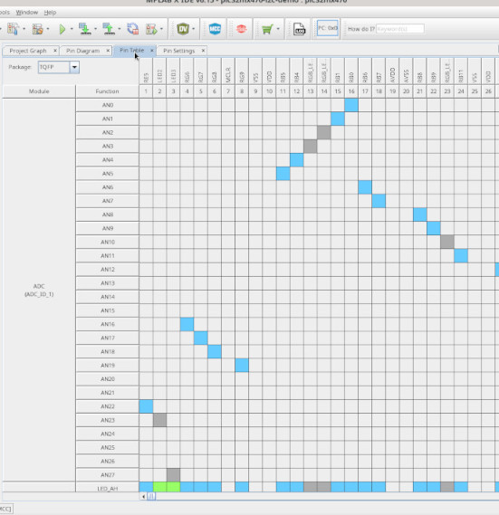
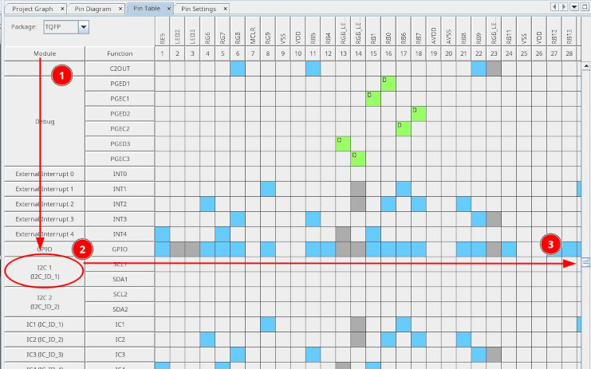
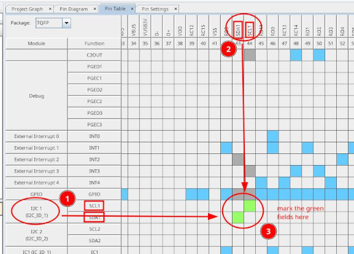
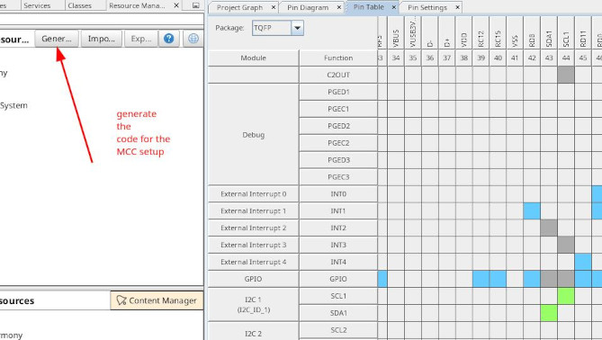

# PIC32MX470: USB HID demo encapsuling a I2C Device

The setup will connect a DC749a multi led board over the mikorbus I
connectors, for the corresponding linux device driver.  

## Setup

The setup is build on a similar base as [the HID demo](../pic32mx470__01-hid-demo).  

Main modification is using the i2c driver and i2c library, link them as here in the image.  
  

Configure the i2c as synchronous driver, leave the rest as is.  

## Modifications

Enable the i2c setup with the pin configurator, for the `MikroBus I` interface.  

  
  
  
  
  

