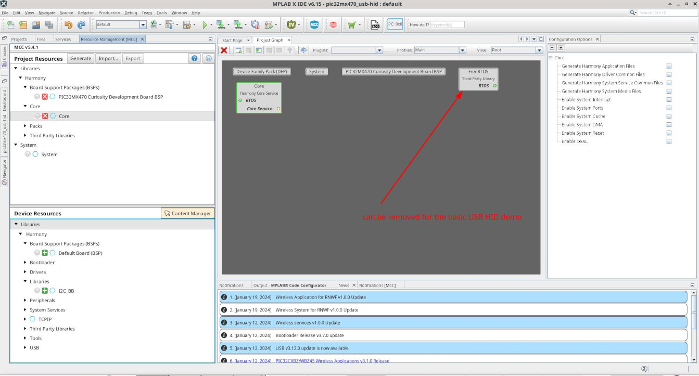
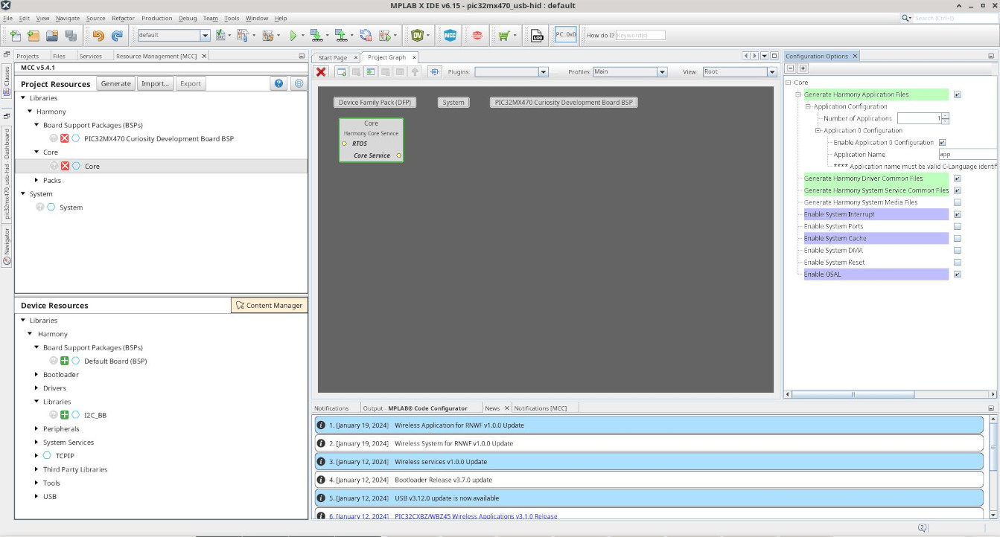
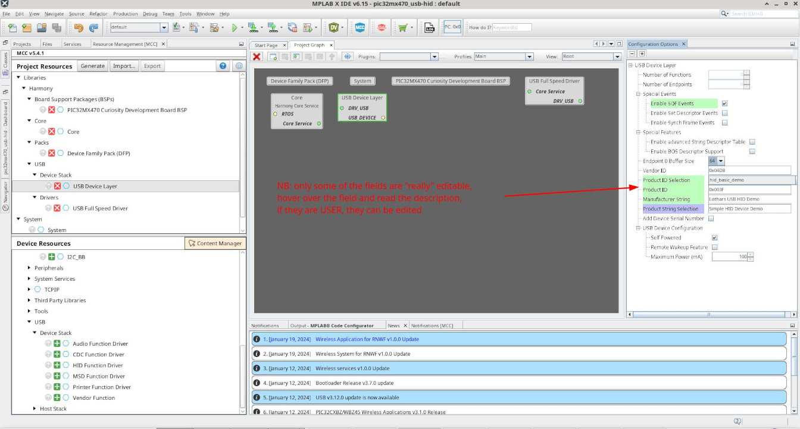

# PIC32MX470

## MPLAB X IDE

-> See my notes on basic PIC32 setup.  

## PIC32 Code

#### PIC32MX: Microchip's USB Demo Projects

There are USB HID demos, try to verify the setup by building them and playing them on the PIC32MX470, if e.g. `hid_basic_demo` works out, the setup is ok.  

For the Microchip demos, build the USB Device Library Application using the _M_PLAB _H_armony _C_onfigurator (MHC). Either implement yourself, or use the provided demos as a starting point, e.g.
`./harmony/harmony3/usb_apps_device/apps/hid_basic/firmware/pic32mx470_curiosity.X/nbproject/project.xml` (watch out for a "project.xml")  

## USB HID Demo

This is +/- how the setup of the USB HID Demo as a new project. Type `CTRL + SHIFT + n` (or `File -> New Project`) to start a new project.  

  
  
  
  
  
  
  
  
  
  
  
  
  
  
  
  
  
  
  
  
  
  
  
  

#### Source Organization

- Find the implementation in `app.c`, `app.h` and `main.c`
- The platform here is `default`, it is not supposed to be modified
- Find available LED instructions in `./firmware/src/config/default/bsp/bsp.h`
- USB device driver is prepared also in config/default

This Implementation registers for USB read requests directly, instead of setting up yet another state machine, then going into a USB-wait-for-data-state  

#### One word about MHC / Clocking plugin

After the MCC setup was setup, or anyhow adjusted, you need to `generate` the setup. Only this will generate the code. In case a meld-based diff will pop up to accept the design modifications to the project `src`. Example, the clock settings are by default turned off, no divider are seetup and USB won't clocked. This can be adjusted in the `plugin -> Clock Settings`. This is _not_ sufficient. Do the `generate` and accept the settings e.g. into the `./usb/initialization.c` file.  

## Flashing the Demo to the Target

TODO        

## References
* https://ww1.microchip.com/downloads/aemDocuments/documents/OTH/ProductDocuments/UserGuides/MPLABHarmonyConfiguratorUsersGuide_v111.pdf  
