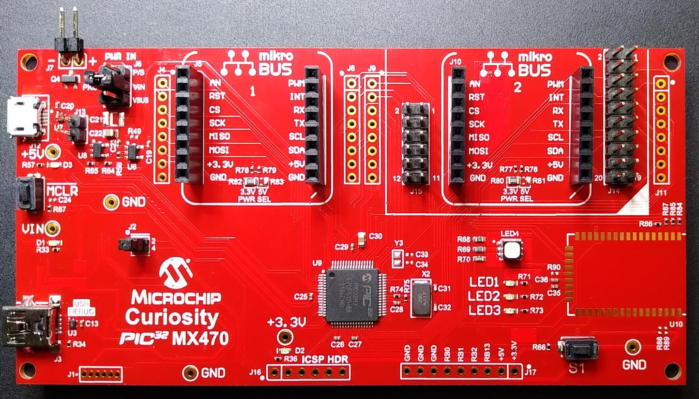
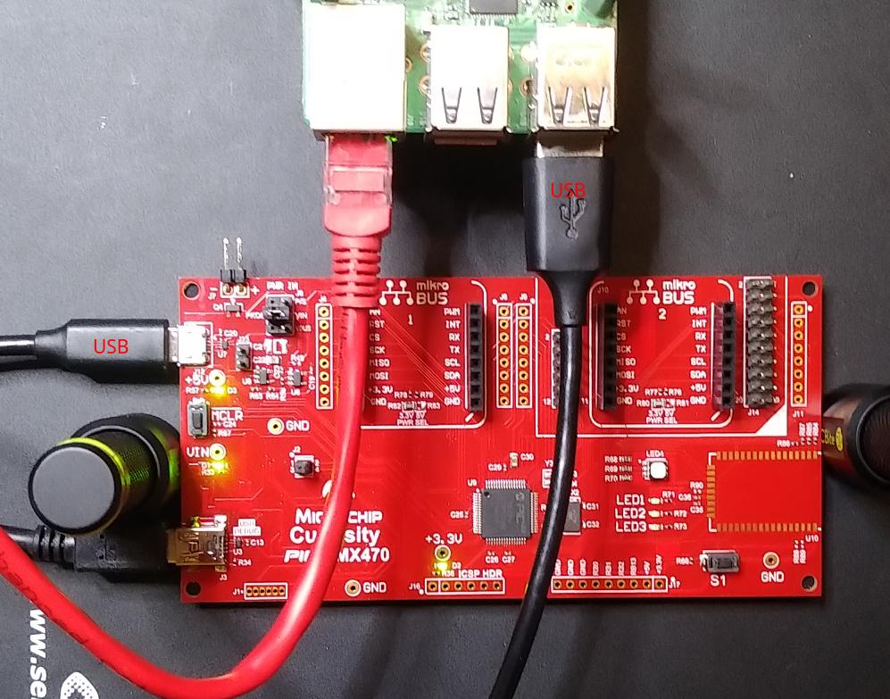

# Driving LEDs on the PIC32MX470 connected over USB

  

Kernel Config: make sure the following is set:  
- `CONFIG_HID_SUPPORT`
- `CONFIG_HID_GENERIC`

Make sure the following is _NOT_ set (or at least as module, then
unload the module). Alternatively a udev rule has to be in place
additionally to allow for USB matching:  
- `CONFIG_USB_HID`


## Some notes on USB

USB is a huge topic. Here just some general notes, as needed for the
driver implementation.  

#### USB Fundamentals

Information is requested in terms of **descriptors**. USB descriptors
are data structures that are provided by devices to describe all of
their attributes. This includes e.g. the product/vendor ID, any device
class affiliation and strings describing the product and vendor.  

Endpoints can be categorized into **control** and **data**
endpoints. Every USB device must provide at least one control endpoint
at address 0 called the default endpoint. The endpoint number is a
4-bit integer associated with an endpoint (0-15); the same endpoint
number is used to describe two endpoints, for instance EP1 IN and EP1
OUT. Examples: `EP1 IN = 0x81`, `EP1 OUT = 0x01`, `EP3 IN = 0x83` or
`EP3 OUT = 0x03`.  

#### USB Data Transfers

- *Control Transfer*: Used to configure a device at attach and can be used for other device-specific purposes, such as specific register read/write access, or control of other pipes on the device
- *Bulk Data Transfer*: Transfer of relatively large quantities of data or data bursts; bulk transfers do not have guaranteed timing, but can provide the fastest data transfer rates
- *Interrupt Data Transfer*: Used for reliable delivery of data, e.g. characters or coordinates with human-perceptible echo or feedback response characteristics; USB mice and keyboards typically use interrupt data transfers
- *Isochronous Data Transfer*: Isochronous transfers have guaranteed timing, but do _not_ have error correction capability; isochronous data must be delivered at the rate received to maintain its timing and additionally may be sensitive to delivery delay; typically used for streaming audio or video

#### USB Request Block (URB)

Any communication between the host and device is done asynchronously
by using USB Request Blocks (URBs).   

- An URB consists of all relevant information to execute any USB transaction and deliver the data and status back.
- Execution of an URB is inherently an asynchronous operation, i.e. the `usb_submit_urb()` call returns immediately after it has successfully queued the requested action.
- Transfers for one URB can be canceled with `usb_unlink_urb()` at any time.
- Each URB has a completion handler, which is called after the action has been successfully completed or canceled. The URB also contains a context-pointer for passing information to the completion handler.
- Each endpoint for a device logically supports a queue of requests. You can fill that queue so that the USB hardware can still transfer data to an endpoint while your driver handles the completion of another. This maximizes use of USB bandwidth and supports seamless streaming of data to (or from) devices when using periodic transfer modes.

#### USB HID Application on PIC32MX

- The application specific initialization can be called in the `APP_Initialize()` function (in the app.c file). The `APP_Initialize()` function is called from the `SYS_Initialize()` function, which in turn is called when the device comes out of `Power-on Reset` (POR).
- The application logic is implemented as a state machine in the `APP_Tasks()` function (in the app.c file). The application logic can interact with the function driver and the `Device_layer` by using available API calls.
- The application logic can track device events by processing the events in the application USB device event handler function (`APP_USBDeviceEventHandler()` function in `app.c`).


## Hardware: Microchip Curiosity PIC32MX470 (PIC32MX470512H)

#### PIC32MX Board

Connection:  
Connect the USB Micro-B port (J12) of the PIC32MX470 Curiosity
Development Board to the J19 USB-B type C connector. In case this will
need a USB type-C male to micro-B male cable.  

  

#### MPLAB X IDE Setup

Figure out the installation of the IDE [here](../pic32mx470__00-basics/README.md).  

#### PIC32MX: USB HID Demo

Figure out how to build the [PIC32 USB HID demo](../pic32mx470__01-hid-demo).  

# Build

## USB HID Driver Situation

About USB HID modules - The module `usbhid` will have priority over the self written drivers. Check if config option `CONFIG_USB_HID` is set. In case of 'm' try to remove the module, or compile the kernel w/o that module for the development setup.  
```
$ sudo rmmod usbhid
```

A cleaner way would then to write a UDEV rule, e.g.  
```
# if no driver has claimed the interface yet, load ftdi_sio
ACTION=="add", SUBSYSTEM=="usb", ENV{DEVTYPE}=="usb_interface", \
        ATTRS{idVendor}=="04d8", ATTRS{idProduct}=="003f", \
        DRIVER=="lothars_usbhid", \
        RUN+="/sbin/modprobe -b usbhid"
```

## Module

Having crossbuild-essentials-arm64 installed, `ARCH`, and `CROSS_COMPILE` set, execute  
```
$ cd ./module__ltc2607-dual-dac
$ make
```
Copy the module over to the target  

## Usage

```
# insmod ./pic32mx470-led.ko
```
Now, connect the USB cable to the RPI, the corrsponding log entry should appear.  
```
# ls /sys/bus/usb/devices/1-1.5\:1.0/
    authorized         bInterfaceClass   bInterfaceProtocol  bNumEndpoints  ep_01  led       power      supports_autosuspend
    bAlternateSetting  bInterfaceNumber  bInterfaceSubClass  driver         ep_81  modalias  subsystem  uevent

# cat /sys/bus/usb/devices/1-1.5\:1.0/bNumEndpoints
    02

# cat /sys/bus/usb/devices/1-1.5\:1.0/bAlternateSetting
     0

# cat /sys/bus/usb/devices/1-1.5\:1.0/bInterfaceClass
    03

# cat /sys/bus/usb/devices/1-1.5\:1.0/ep_01/direction
    out

# cat /sys/bus/usb/devices/1-1.5\:1.0/ep_81/direction
    in

# echo 1 > /sys/bus/usb/devices/1-1.5\:1.0/led
# echo 1 > /sys/bus/usb/devices/1-1.5\:1.0/led
# echo 2 > /sys/bus/usb/devices/1-1.5\:1.0/led
# echo 3 > /sys/bus/usb/devices/1-1.5\:1.0/led
# echo 0 > /sys/bus/usb/devices/1-1.5\:1.0/led
    bash: echo: write error: Invalid argument

# echo 3 > /sys/bus/usb/devices/1-1.5\:1.0/led

# cat /sys/bus/usb/devices/1-1.5\:1.0/led
    3

# rmmod pic32mx470-led.ko
```

Logs   
```
Jan 28 05:26:51 ctrl001 kernel: [17251.725091] usbcore: registered new interface driver lothars_usbled

Jan 28 05:27:01 ctrl001 kernel: [17261.907877] usb 1-1.5: new full-speed USB device number 9 using dwc_otg
Jan 28 05:27:02 ctrl001 kernel: [17262.010907] usb 1-1.5: New USB device found, idVendor=04d8, idProduct=003f, bcdDevice= 1.00
Jan 28 05:27:02 ctrl001 kernel: [17262.010936] usb 1-1.5: New USB device strings: Mfr=1, Product=2, SerialNumber=0
Jan 28 05:27:02 ctrl001 kernel: [17262.010951] usb 1-1.5: Product: Simple HID Device Demo
Jan 28 05:27:02 ctrl001 kernel: [17262.010964] usb 1-1.5: Manufacturer: Lothars USB HID Demo
Jan 28 05:27:02 ctrl001 kernel: [17262.014172] lothars_usbled 1-1.5:1.0: usbled_probe() - called
Jan 28 05:27:02 ctrl001 mtp-probe: checking bus 1, device 9: "/sys/devices/platform/soc/3f980000.usb/usb1/1-1/1-1.5"
Jan 28 05:27:02 ctrl001 mtp-probe: bus: 1, device: 9 was not an MTP device
Jan 28 05:27:02 ctrl001 mtp-probe: checking bus 1, device 9: "/sys/devices/platform/soc/3f980000.usb/usb1/1-1/1-1.5"
Jan 28 05:27:02 ctrl001 mtp-probe: bus: 1, device: 9 was not an MTP device

Jan 28 05:30:51 ctrl001 kernel: [17491.408181] lothars_usbled 1-1.5:1.0: led_store() - called
Jan 28 05:30:51 ctrl001 kernel: [17491.408243] lothars_usbled 1-1.5:1.0: led_store() - led = 1

Jan 28 05:31:27 ctrl001 kernel: [17527.259302] lothars_usbled 1-1.5:1.0: led_store() - called
Jan 28 05:31:27 ctrl001 kernel: [17527.259354] lothars_usbled 1-1.5:1.0: led_store() - led = 1

Jan 28 05:31:45 ctrl001 kernel: [17545.071685] lothars_usbled 1-1.5:1.0: led_store() - called
Jan 28 05:31:45 ctrl001 kernel: [17545.071737] lothars_usbled 1-1.5:1.0: led_store() - led = 2

Jan 28 05:31:55 ctrl001 kernel: [17555.298563] lothars_usbled 1-1.5:1.0: led_store() - called
Jan 28 05:31:55 ctrl001 kernel: [17555.298819] lothars_usbled 1-1.5:1.0: led_store() - led = 3

Jan 28 05:32:04 ctrl001 kernel: [17564.495457] lothars_usbled 1-1.5:1.0: led_store() - called
Jan 28 05:32:04 ctrl001 kernel: [17564.495487] lothars_usbled 1-1.5:1.0: led_store() - unknown led 0

Jan 28 05:32:33 ctrl001 kernel: [17593.002788] lothars_usbled 1-1.5:1.0: led_store() - called
Jan 28 05:32:33 ctrl001 kernel: [17593.002840] lothars_usbled 1-1.5:1.0: led_store() - led = 3

Jan 28 05:32:50 ctrl001 kernel: [17610.578541] usbcore: deregistering interface driver lothars_usbled
Jan 28 05:32:50 ctrl001 kernel: [17610.578712] lothars_usbled 1-1.5:1.0: usbled_disconnect() - called
Jan 28 05:32:50 ctrl001 kernel: [17610.578758] lothars_usbled 1-1.5:1.0: usbled_disconnect() - usb led is now disconnected
```

  

## References
- https://www.microchip.com/DevelopmentTools/ProductDetails/dm320103
- https://ww1.microchip.com/downloads/aemDocuments/documents/UNG/ProductDocuments/UserGuides/USBLibraries_v111.pdf
- Linux Driver Development for Embedded Procesesors, A. L. Rios, 2018, p. 594ff, p. 616; The demo idea is taken from Alberto Liberal, pic implementation is different and the kernel sources were updated and modified to run in the setup.
