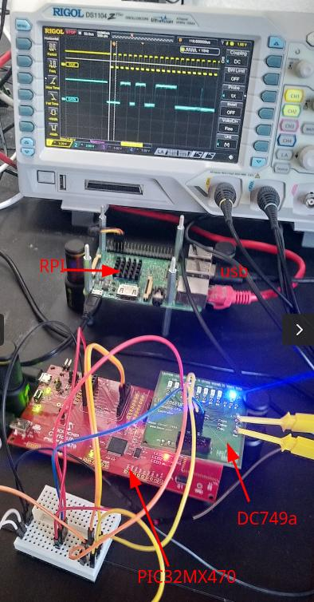
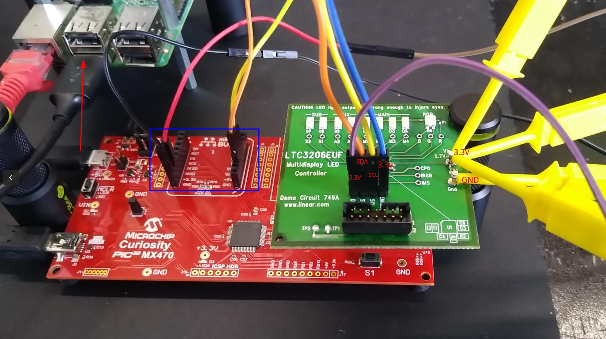
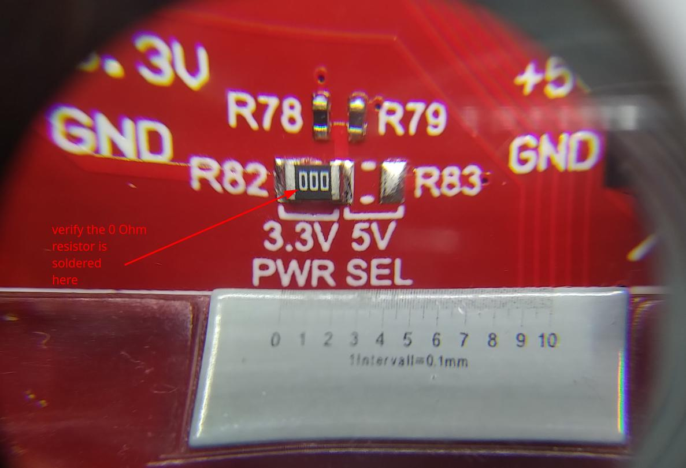
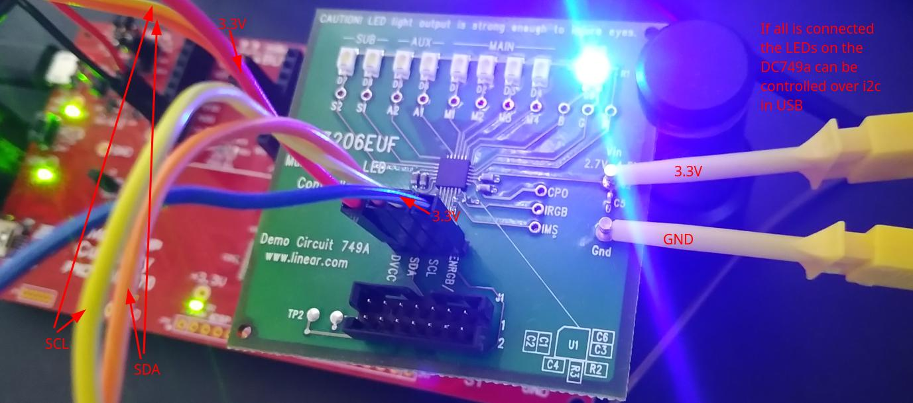

# PIC32MX470: wrap an i2c device in usb

  

The DC749a board is connected by i2c to the PIC32MX470. The PIC32MX470
board is connected by usb to the RPI. The module of this demo wraps
the i2c into usb, i.e. using the `i2cdetect` will show a connected i2c
device when usb is connected and the driver is loaded. Internally this
will be implemented similar to the book excample in an urb packaged
communication.  

The PIC32 driver only will need to implement a minimal usb state
machine. Additionally it opens the i2c device, which also needs to be
added in MCC, and connected in the interrupt configurator (check that
the PLL is configured as needed to provide sufficient clocking for the
usb device). After opening the i2c connection, then the app only takes
usb received buffer and writes it to the i2c, as reads out the i2c
buffer transmitting it to usb.  

Kernel Config: make sure the following is set:  
- `CONFIG_HID_SUPPORT`
- `CONFIG_HID_GENERIC`
- Make sure kernel module i2c_dev is loaded

Make sure the following is _NOT_ set (or at least as module, then
unload the module). Alternatively a udev rule has to be in place
additionally to allow for USB matching:  
- `CONFIG_USB_HID`


## Hardware: Microchip Curiosity PIC32MX470 (PIC32MX470512H)

#### PIC32 Board
https://www.microchip.com/DevelopmentTools/ProductDetails/dm320103

Connection:  
Connect the USB Micro-B port (J12) of the PIC32MX470 Curiosity
Development Board to the J19 USB-B type C connector. In case this will
need a USB type-C male to micro-B male cable.  


#### DC749A Board
https://www.analog.com/en/design-center/evaluation-hardware-and-software/evaluation-boards-kits/dc749a.html

Connection  

- SDA (PIC32) -> pin 7, SDA of the DC749a J1
- SCL (PIC32) -> pin 4, SCL (DC749a)
- 3.3V (PIC32) -> Vin (DC749a)
- J20 DVCC pin (DC749a) -> Vin (DC749a)
- pin 6, ENRGB/S (DC749a) -> Vin (DC749a)
- GND (PIC32) -> GND (DC749a)

  

NB: Verify on the PIC32MX470 Dev Board that the series resistors
mounted on the SCL and SDA lines of the **MikroBUS 1 socket J5** are
set to **0 Ohms**, if not replace them with 0 Ohms. Alternatively take
the signals directly from the J6 connector.  

  


## Software: MPLAB X IDE

MPLAB X IDE: https://www.microchip.com/en-us/tools-resources/develop/mplab-x-ide#tabs

```
$ sudo apt install -y libusb-1.0-0
$ tar xf ./MPLABX-v6.15-linux-installer.tar
$ sudo ./MPLABX-v6.15-linux-installer.sh
-> only select MPLAB X IDE, and
-> PIC32 support
```

## Setup the HID Application in the MPLAB IDE

This is desribed [here](../pic32mx470__03-hid-dc749a-demo/README.md).  

# Build

## Devicetree

Copy it to the specified location in the linux sources, then build it  
```
$ cd linux
$ cp -arf <SOURCES>/devicetree/arch ./
$ find . -name \*.dtb -delete
$ make dtbs
  DTC     arch/arm64/boot/dts/broadcom/bcm2710-rpi-3-b.dtb
```
Copy the file `bcm2710-rpi-3-b.dtb` to the target overwriting the `/boot/bcm2710-rpi-3-b.dtb`. In case make a safety backup first.  

## Module

Having crossbuild-essentials-arm64 installed, `ARCH`, and `CROSS_COMPILE` set, execute  
```
$ cd ./module__ltc2607-dual-dac
$ make
```
Copy the module over to the target  

## Usage

Build and flash the MPLAB design to the connected Pic32 board (needs to be connected via USB).  

```
# modprobe i2c_dev

# lsmod | grep i2c
    i2c_dev                24576  0
    i2c_mux_pinctrl        16384  0
    i2c_mux                16384  1 i2c_mux_pinctrl
    i2c_bcm2835            16384  0

# i2cdetect -l
    i2c-10	i2c       	i2c-11-mux (chan_id 1)          	I2C adapter
    i2c-1	i2c       	bcm2835 (i2c@7e804000)          	I2C adapter
    i2c-11	i2c       	bcm2835 (i2c@7e205000)          	I2C adapter
    i2c-0	i2c       	i2c-11-mux (chan_id 0)          	I2C adapter

# insmod ./pic32mx470-led.ko
```

Now connect the usb cable.  
```
# i2cdetect -l
    i2c-10	i2c       	i2c-11-mux (chan_id 1)          	I2C adapter
    i2c-1	i2c       	bcm2835 (i2c@7e804000)          	I2C adapter
    i2c-11	i2c       	bcm2835 (i2c@7e205000)          	I2C adapter
    i2c-0	i2c       	i2c-11-mux (chan_id 0)          	I2C adapter
    i2c-12	i2c       	lothars_usb_ltc3206 at bus 0x00000001 device 0x	I2C adapter  <------ added usb device shows up as i2c #12

# ls -l /sys/bus/usb/devices/1-1.2\:1.0/
    total 0
    -rw-r--r-- 1 root root 4096 Feb  3 15:22 authorized
    -r--r--r-- 1 root root 4096 Feb  3 15:22 bAlternateSetting
    -r--r--r-- 1 root root 4096 Feb  3 15:19 bInterfaceClass
    -r--r--r-- 1 root root 4096 Feb  3 15:19 bInterfaceNumber
    -r--r--r-- 1 root root 4096 Feb  3 15:22 bInterfaceProtocol
    -r--r--r-- 1 root root 4096 Feb  3 15:19 bInterfaceSubClass
    -r--r--r-- 1 root root 4096 Feb  3 15:19 bNumEndpoints
    lrwxrwxrwx 1 root root    0 Feb  3 15:19 driver -> ../../../../../../../../bus/usb/drivers/lothars_usb_ltc3206
    drwxr-xr-x 3 root root    0 Feb  3 15:22 ep_01
    drwxr-xr-x 3 root root    0 Feb  3 15:22 ep_81
    drwxr-xr-x 4 root root    0 Feb  3 15:19 i2c-12
    -r--r--r-- 1 root root 4096 Feb  3 15:22 modalias
    drwxr-xr-x 2 root root    0 Feb  3 15:22 power
    lrwxrwxrwx 1 root root    0 Feb  3 15:19 subsystem -> ../../../../../../../../bus/usb
    -r--r--r-- 1 root root 4096 Feb  3 15:22 supports_autosuspend
    -rw-r--r-- 1 root root 4096 Feb  3 15:19 uevent

# i2cset -y 12 0x1b 0x00 0xf0 0x00 i
# i2cset -y 12 0x1b 0xf0 0x00 0x00 i
# i2cset -y 12 0x1b 0x10 0x00 0x00 i
# i2cset -y 12 0x1b 0x00 0x0f 0x00 i
# i2cset -y 12 0x1b 0x00 0x0f 0x0f i
# i2cset -y 12 0x1b 0x00 0x00 0xf0 i

# rmmod pic32mx470-led.ko
```

Logs   
```
[16:37:03.807] Feb  3 15:16:38 ctrl001 kernel: [ 3584.345656] usbcore: registered new interface driver lothars_usb_ltc3206
<USB cable connects>
[16:39:41.744] Feb  3 15:19:16 ctrl001 kernel: [ 3742.285658] usb 1-1.2: new full-speed USB device number 6 using dwc_otg
[16:39:41.870] Feb  3 15:19:16 ctrl001 kernel: [ 3742.389843] usb 1-1.2: New USB device found, idVendor=04d8, idProduct=003f, bcdDevice= 1.00
[16:39:41.871] Feb  3 15:19:16 ctrl001 kernel: [ 3742.389893] usb 1-1.2: New USB device strings: Mfr=1, Product=2, SerialNumber=0
[16:39:41.872] Feb  3 15:19:16 ctrl001 kernel: [ 3742.389922] usb 1-1.2: Product: Simple HID Device Demo
[16:39:41.872] Feb  3 15:19:16 ctrl001 kernel: [ 3742.389948] usb 1-1.2: Manufacturer: Lothars USB HID Demo
[16:39:41.873] Feb  3 15:19:16 ctrl001 kernel: [ 3742.395715] lothars_usb_ltc3206 1-1.2:1.0: ltc3206_probe(): called
[16:39:41.913] Feb  3 15:19:16 ctrl001 kernel: [ 3742.395792] lothars_usb_ltc3206 1-1.2:1.0: ltc3206_init(): called
[16:39:41.914] Feb  3 15:19:16 ctrl001 kernel: [ 3742.395818] lothars_usb_ltc3206 1-1.2:1.0: ltc3206_init(): ltc3206 at USB bus 0x00000001 address 0x00000006
[16:39:41.915] Feb  3 15:19:16 ctrl001 kernel: [ 3742.399203] lothars_usb_ltc3206 1-1.2:1.0: ltc3206_probe(): connected
[16:39:41.916] Feb  3 15:19:16 ctrl001 mtp-probe: checking bus 1, device 6: "/sys/devices/platform/soc/3f980000.usb/usb1/1-1/1-1.2"
[16:39:41.934] Feb  3 15:19:16 ctrl001 mtp-probe: bus: 1, device: 6 was not an MTP device
[16:39:41.986] Feb  3 15:19:16 ctrl001 mtp-probe: checking bus 1, device 6: "/sys/devices/platform/soc/3f980000.usb/usb1/1-1/1-1.2"
[16:39:41.987] Feb  3 15:19:16 ctrl001 mtp-probe: bus: 1, device: 6 was not an MTP device

[16:44:49.127] Feb  3 15:24:23 ctrl001 kernel: [ 4049.676123] ltc3206_usb_i2c_xfer(): called
[16:44:52.160] Feb  3 15:24:26 ctrl001 kernel: [ 4049.676143] ltc3206_usb_i2c_xfer(): number of i2c msgs = 1
[16:45:09.952] Feb  3 15:24:44 ctrl001 kernel: [ 4070.495224] ltc3206_usb_i2c_xfer(): called
[16:45:09.953] Feb  3 15:24:44 ctrl001 kernel: [ 4070.495253] ltc3206_usb_i2c_xfer(): number of i2c msgs = 1
[16:45:27.228] Feb  3 15:25:01 ctrl001 kernel: [ 4087.772165] ltc3206_usb_i2c_xfer(): called
[16:45:27.229] Feb  3 15:25:01 ctrl001 kernel: [ 4087.772183] ltc3206_usb_i2c_xfer(): number of i2c msgs = 1
[16:45:48.387] Feb  3 15:25:22 ctrl001 kernel: [ 4108.953011] ltc3206_usb_i2c_xfer(): called
[16:45:50.267] Feb  3 15:25:24 ctrl001 kernel: [ 4108.953030] ltc3206_usb_i2c_xfer(): number of i2c msgs = 1
[16:46:06.311] Feb  3 15:25:40 ctrl001 kernel: [ 4126.857104] ltc3206_usb_i2c_xfer(): called
[16:46:06.312] Feb  3 15:25:40 ctrl001 kernel: [ 4126.857122] ltc3206_usb_i2c_xfer(): number of i2c msgs = 1
[16:46:23.061] Feb  3 15:25:57 ctrl001 kernel: [ 4143.612528] ltc3206_usb_i2c_xfer(): called
[16:46:28.395] Feb  3 15:26:02 ctrl001 kernel: [ 4143.612547] ltc3206_usb_i2c_xfer(): number of i2c msgs = 1

[16:46:38.164] Feb  3 15:26:12 ctrl001 kernel: [ 4158.703193] usbcore: deregistering interface driver lothars_usb_ltc3206
[16:46:38.165] Feb  3 15:26:12 ctrl001 kernel: [ 4158.703392] lothars_usb_ltc3206 1-1.2:1.0: ltc3206_disconnect(): called
```

  

## References
* https://www.analog.com/en/design-center/evaluation-hardware-and-software/evaluation-boards-kits/dc749a.html
* https://www.microchip.com/en-us/tools-resources/develop/mplab-x-ide
* Linux Driver Development for Embedded Procesesors, A. L. Rios, 2018, p. 629ff, p. 648  
