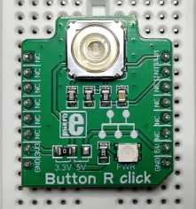

# Sleeping Device

## Hardware: MikroE Button-R-Click



https://www.mikroe.com/button-r-click

Connection:  
- GPIO23 -> INT
- 3v3 -> 3v3
- GND -> GND


# Build

## Devicetree

Copy it to the specified location in the linux sources (6.3), then build it  
```
$ cd linux
$ cp -arf <SOURCES>/devicetree/arch ./

$ make dtbs
  DTC     arch/arm64/boot/dts/broadcom/bcm2710-rpi-3-b.dtb
```
Copy the file `bcm2710-rpi-3-b.dtb` to the target overwriting the `/boot/bcm2710-rpi-3-b.dtb`. Do a safety backup first.  

Debug: Verify the currently loaded DT (or debug) by extracting the DT from the running system  
```
$ sudo reboot
...

$ dtc -I fs /sys/firmware/devicetree/base > ./devicetree.dts
```

## Module

Should crosscompile - having crossbuild-essentials-arm64 installed, ARCH, and CROSS_COMPILE set, execute  
```
$ cd ./module
$ make
```
Copy the module over to the target  

## Usage

```
pi@ctrl001:~ $ sudo insmod irq_click.ko
pi@ctrl001:~ $ sudo su
root@ctrl001:/home/pi# cat /dev/lothars_device > ./states

<press and release the button several times>

^C
root@ctrl001:/home/pi# rmmod irq_click
root@ctrl001:/home/pi# 
```

dump `/var/log/messages` in parallel    
```
...
Nov 18 22:45:18 ctrl001 kernel: [  208.048436] irq_click: loading out-of-tree module taints kernel.
Nov 18 22:45:18 ctrl001 kernel: [  208.050712] intkeywait soc:int_key_wait: lothars_probe() - called
Nov 18 22:45:18 ctrl001 kernel: [  208.050745] intkeywait soc:int_key_wait: lothars_probe() - allocate device structure
Nov 18 22:45:18 ctrl001 kernel: [  208.050774] intkeywait soc:int_key_wait: lothars_probe() - init the wait queue head
Nov 18 22:45:18 ctrl001 kernel: [  208.050798] intkeywait soc:int_key_wait: lothars_probe() - get virtual int number from device
Nov 18 22:45:18 ctrl001 kernel: [  208.051094] intkeywait soc:int_key_wait: lothars_probe() - irq number '185' by platform_get_irq()
Nov 18 22:45:18 ctrl001 kernel: [  208.052102] intkeywait soc:int_key_wait: lothars_probe() - done

Nov 18 22:45:40 ctrl001 kernel: [  229.798911] intkeywait soc:int_key_wait: lothars_key_isr() - interrupt received, key: PB_USER
Nov 18 22:45:40 ctrl001 kernel: [  229.798944] intkeywait soc:int_key_wait: lothars_key_isr() - button state 0x00000000
Nov 18 22:45:40 ctrl001 kernel: [  229.963722] intkeywait soc:int_key_wait: lothars_key_isr() - interrupt received, key: PB_USER
Nov 18 22:45:40 ctrl001 kernel: [  229.963753] intkeywait soc:int_key_wait: lothars_key_isr() - button state 0x00000000

Nov 18 22:45:46 ctrl001 kernel: [  235.819157] intkeywait soc:int_key_wait: lothars_key_isr() - interrupt received, key: PB_USER
Nov 18 22:45:46 ctrl001 kernel: [  235.819188] intkeywait soc:int_key_wait: lothars_key_isr() - button state 0x00000000
Nov 18 22:45:46 ctrl001 kernel: [  236.012837] intkeywait soc:int_key_wait: lothars_key_isr() - interrupt received, key: PB_USER
Nov 18 22:45:46 ctrl001 kernel: [  236.012868] intkeywait soc:int_key_wait: lothars_key_isr() - button state 0x00000000

Nov 18 22:45:54 ctrl001 kernel: [  243.175878] intkeywait soc:int_key_wait: lothars_key_isr() - interrupt received, key: PB_USER
Nov 18 22:45:54 ctrl001 kernel: [  243.175909] intkeywait soc:int_key_wait: lothars_key_isr() - button state 0x00000000
Nov 18 22:45:54 ctrl001 kernel: [  243.299837] intkeywait soc:int_key_wait: lothars_key_isr() - interrupt received, key: PB_USER
Nov 18 22:45:54 ctrl001 kernel: [  243.299871] intkeywait soc:int_key_wait: lothars_key_isr() - button state 0x00000000

Nov 18 22:46:10 ctrl001 kernel: [  259.240578] intkeywait soc:int_key_wait: lothars_remove() - called
...
```
The read function is polled on the device state changes, press and release is logged.    

Observe the state changes logged, most of the file will be empty lines, button state changes occur somehow.   
```
root@ctrl001:/home/pi# nl ./states 
     1	
     2	
     3	
...
  1781	
  1782	
  1783	
  1784	
  1785	R
  1786	
  1787	
  1788	
  1789	
...
```

## References
* Linux Driver Development for Embedded Procesesors, A. L. Rios, 2018, p. 300  
