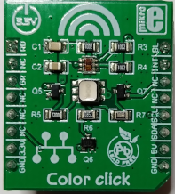
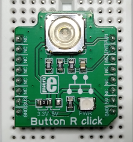
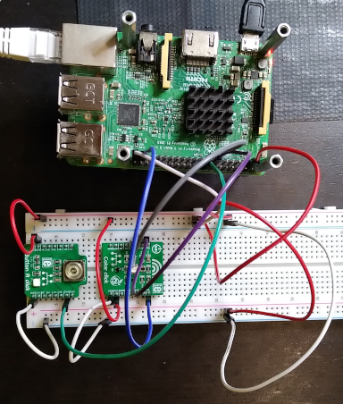
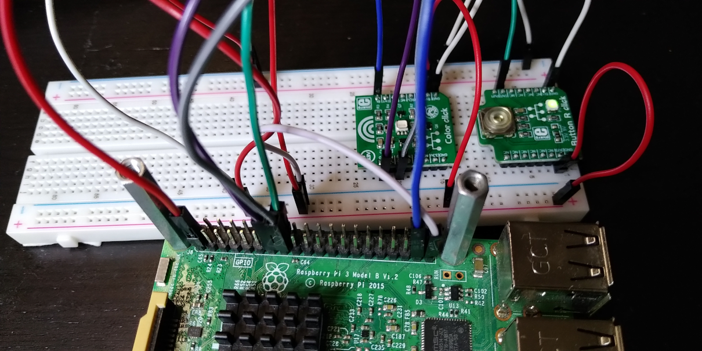
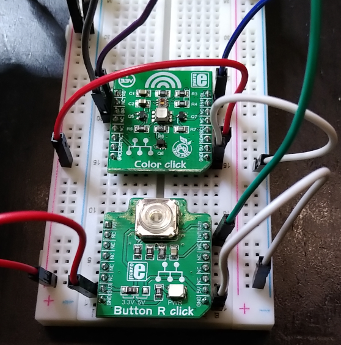

# Keyless Class Module

The demo creates several led devices under the "Keyled" class and also several sysfs entries under each led device. Each led device can be controlled by writing from user space to the sysfs entries under each led device. There is no cdev structure initialized for each device (adding as an argument a file_operations structure) and thus there won't be a led device under /dev which could be controlled by a syscall.  

Control the led devices by writing to the sysfs entries under `/sys/class/Keyled/<led device>/` directory.  

Debug: This is demo code, for a project always check a driver using memcheck (if allocation are happening), lockdep (if locking was used), etc.  

## Hardware:



MikroE Color-Click: https://www.mikroe.com/color-click  
Connect:  
- GPIO27 -> RD pin  
- GPIO22 -> GR pin  
- GPIO26 -> BL pin  
- 3V3 -> 5V, or connect 5V directly (won't show up when connected to 3V3) 
- GND -> GND  



MikroE Button-R-Click: https://www.mikroe.com/button-r-click  
Connect:  
- GPIO23 -> INT (Button-R-Click)  
- 3V3 -> 3V3  
- GND -> GND  



Connection details:  





# Build

## Devicetree

copy it to the specified location in the linux sources (6.3), then build it  
```
$ cd linux
$ cp -arf <SOURCES>/devicetree/arch ./

$ make dtbs
  DTC     arch/arm64/boot/dts/broadcom/bcm2710-rpi-3-b.dtb
```
Copy the file `bcm2710-rpi-3-b.dtb` to the target overwriting the `/boot/bcm2710-rpi-3-b.dtb`. In case make a safety backup first.  

## Module

Should crosscompile - having crossbuild-essentials-arm64 installed, ARCH, and CROSS_COMPILE set, execute  
```
$ cd ./module
$ make
```
Copy the module over to the target  

## Usage

Load the module and press the Button-R-0Click   
```
$ sudo insmod irq_click.ko
```

Let the log run aside  
```
...
Nov 20 13:56:37 ctrl001 kernel: [12595.456404] ledpwm soc:ledpwm: lothars_probe() - called
Nov 20 13:56:37 ctrl001 kernel: [12595.456778] ledpwm soc:ledpwm: lothars_probe() - there are 5 nodes
Nov 20 13:56:37 ctrl001 kernel: [12595.456829] ledpwm soc:ledpwm: lothars_probe() - priv data structure allocated
Nov 20 13:56:37 ctrl001 kernel: [12595.456857] ledpwm soc:ledpwm: lothars_probe() - the major number is 237
Nov 20 13:56:37 ctrl001 kernel: [12595.457261] ledpwm soc:ledpwm: lothars_probe() - irq number 185
Nov 20 13:56:37 ctrl001 kernel: [12595.457506] ledpwm soc:ledpwm: lothars_probe() - irq number: 186
Nov 20 13:56:37 ctrl001 kernel: [12595.458071] keyled red: led_device_register() - major: 237
Nov 20 13:56:37 ctrl001 kernel: [12595.458103] keyled red: led_device_register() - minor: 0
Nov 20 13:56:37 ctrl001 kernel: [12595.458128] keyled red: led_device_register() - led red added
Nov 20 13:56:37 ctrl001 kernel: [12595.458707] keyled green: led_device_register() - major: 237
Nov 20 13:56:37 ctrl001 kernel: [12595.458747] keyled green: led_device_register() - minor: 1
Nov 20 13:56:37 ctrl001 kernel: [12595.458772] keyled green: led_device_register() - led green added
Nov 20 13:56:37 ctrl001 kernel: [12595.459298] keyled blue: led_device_register() - major: 237
Nov 20 13:56:37 ctrl001 kernel: [12595.459332] keyled blue: led_device_register() - minor: 2
Nov 20 13:56:37 ctrl001 kernel: [12595.459357] keyled blue: led_device_register() - led blue added
Nov 20 13:56:37 ctrl001 kernel: [12595.459518] ledpwm soc:ledpwm: lothars_probe() - out of device-tree
Nov 20 13:56:37 ctrl001 kernel: [12595.459545] ledpwm soc:ledpwm: lothars_probe() - the led period is: 10
Nov 20 13:56:37 ctrl001 kernel: [12595.459569] ledpwm soc:ledpwm: lothars_probe() - done
...
Nov 20 13:56:48 ctrl001 kernel: [12606.402807] ledpwm soc:ledpwm: KEY_ISR1() - interrupt MIKROBUS_KEY1 received, key: MIKROBUS_KEY1
Nov 20 13:56:48 ctrl001 kernel: [12606.402839] ledpwm soc:ledpwm: KEY_ISR1() - the led period is 20
```

Check the ISR1 handler  
```
root@ctrl001:/home/pi# watch "cat /proc/interrupts "
```
Now click the buttons of the Button-R-Click board and watch the counter(s) increasing for the ISR1  

Playing with the leds  
```
root@ctrl001:/home/pi# echo on > /sys/class/keyled/
    blue/  green/ red/
root@ctrl001:/home/pi# echo on > /sys/class/keyled/blue/set_led
root@ctrl001:/home/pi# echo 100 > /sys/class/keyled/blue/set_period
root@ctrl001:/home/pi# echo on > /sys/class/keyled/blue/blink_on_led
    <for instance change the frequency>
root@ctrl001:/home/pi# echo 500 > /sys/class/keyled/blue/set_period
    <blue led blinks>

root@ctrl001:/home/pi# echo off > /sys/class/keyled/blue/blink_off_led
```
Similar with the other led colors.  
```
root@ctrl001:/home/pi# echo on > /sys/class/keyled/green/blink_on_led
root@ctrl001:/home/pi# echo off > /sys/class/keyled/green/blink_off_led

root@ctrl001:/home/pi# echo on > /sys/class/keyled/red/blink_on_led
root@ctrl001:/home/pi# echo off > /sys/class/keyled/red/blink_off_led
```

## References
* Linux Driver Development for Embedded Procesesors, A. L. Rios, 2018, p. 313  
