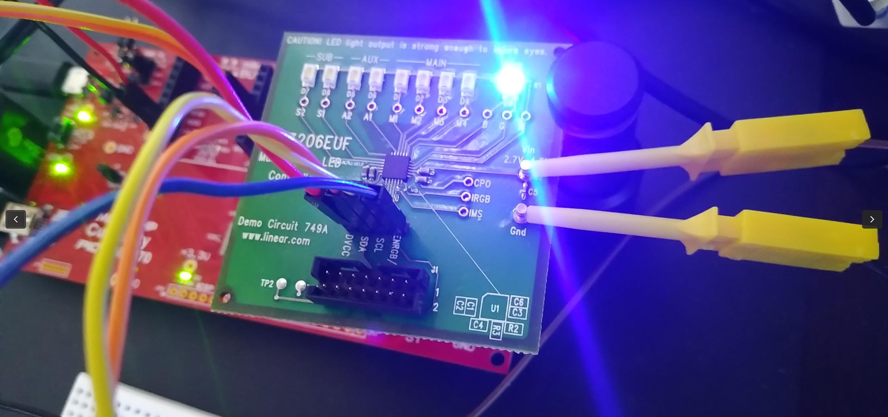

# Lothar's Kernel Codes

  

Use the code snippets at your own risk. No guarantees!  

Find here my demos, code snippets, assembled, fixed, modified, adjusted or extended examples from literature, reimplemented by the idea or simply found sources. I tried to provide documentation and references to the best of my knowledge. Many of the examples come with a README.md. Some require additional hardware.  

**Reference platform is the RPi 3b** 64-bit. In some cases x86 (64-bit). For the usb demos I use a PIC32 board as a counterpart for some of the USB demos.  

The sources are built by running make. A variable `KERNELDIR` can be set in the environment with the path to the kernel sources, default is `/usr/src/linux`. `CROSS_COMPILE` and `ARCH` should be set accordingly (as usual when cross compiling).  
