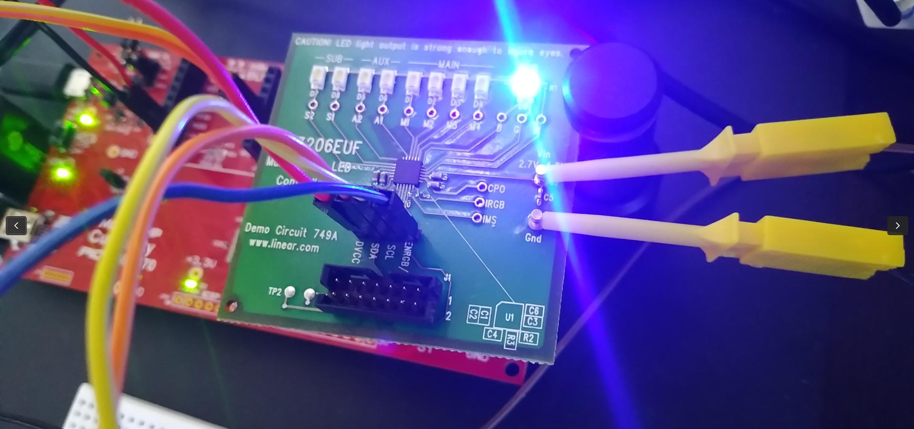

<!---

-->

# Lothar's Kernel Codes

  

No guarantee! No Warranty! No return! Use the codes at your own risk.  

Find here demos, code snippets, collected, implemented, assembled, fixed, modified, adjusted, extended examples from literature, reimplemented by the idea, or simply
kernel sources. I tried to provide documentation and references to the best of my knowledge, check out the provided READMEs. Some demos require additional hardware.  

All demos were verified on my **RPi 3b** 64-bit, with a linux 6.3.x. In some cases x86 (64-bit) with same kernel. For the usb demos I used a PIC32 board as
communication counterpart.  

The sources are built with `make`. In case provide `KERNELDIR`, `ARCH`, `CROSS_COMPILE` in the environment. `KERNELDIR` defaults to `/usr/src/linux`.  
